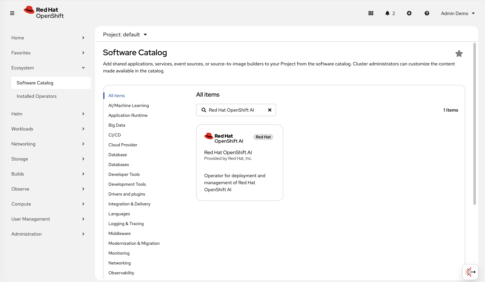
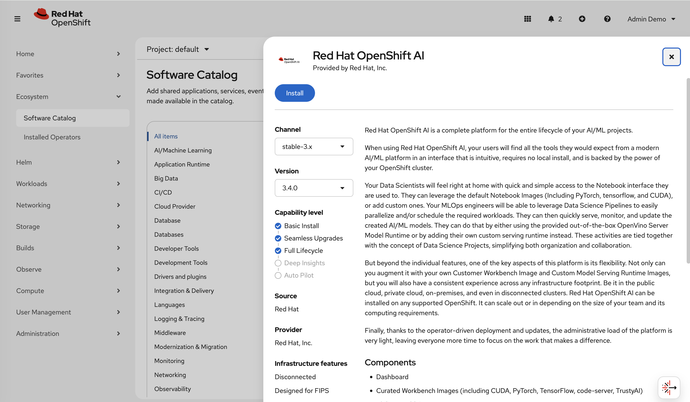
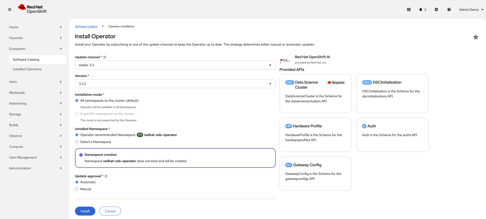
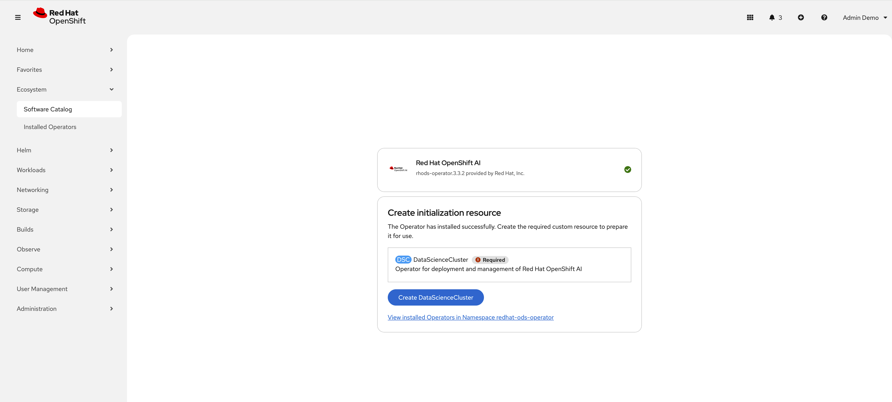
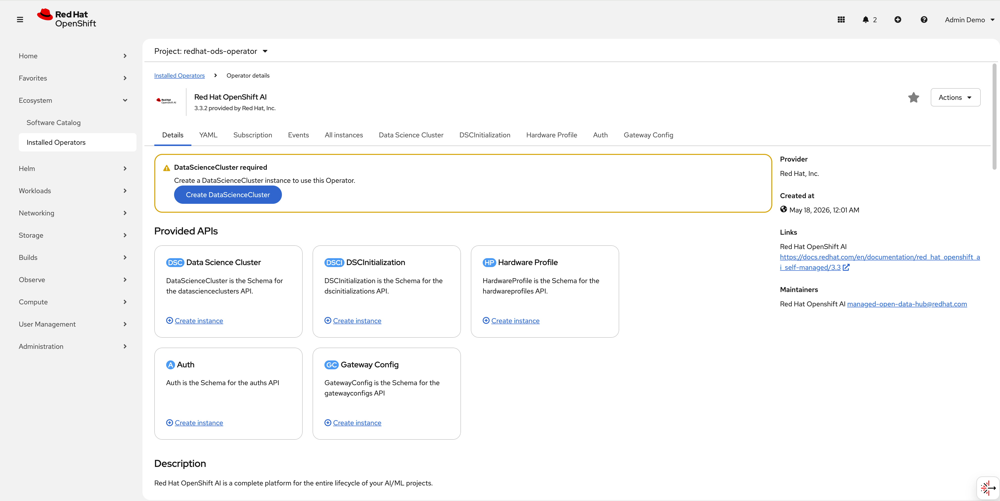
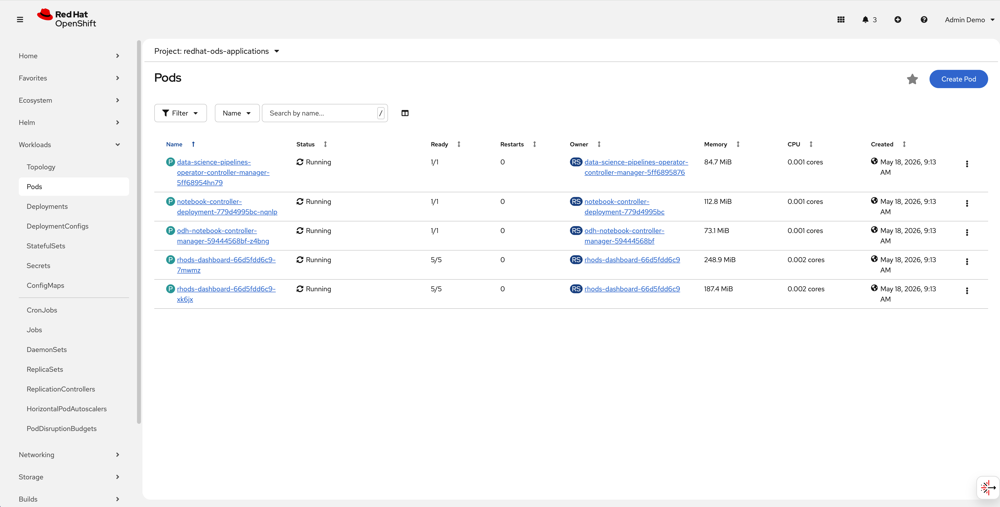

# Installation and Baseline Configuration

In this lab, you will perform a clean installation of the Red Hat OpenShift AI platform. You will learn how to prepare the cluster, install the meta-operator, and initialize the global environment settings.

## Install the Red Hat OpenShift AI Operator

The Operator acts as the control plane for all AI services. We will install it using the OpenShift Web Console.

1. Log in to the [OpenShift Web Console](https://console-openshift-console.<CLUSTER_DOMAIN>) as a `cluster-admin`.
2. Navigate to **Ecosystem** → **Software Catalog** (or **Operators** → **OperatorHub** depending on your specific console configuration).
3. Search for  and click the tile.


4. Click  **Install** .


5. On the Install Operator page:

* **Update channel:** Select `stable-3.3`.
* **Installation mode:** `All namespaces on the cluster`.
* **Installed Namespace:** Select `Operator recommended Namespace: redhat-ods-operator`.
* **Update approval:** Select `Automatic`.


6. Click **Install** and wait for the status to change to  **Succeeded** .



7. Besides the console, check the operator's pods in the target namespace to verify its status:

```bash
   oc get pods -n redhat-ods-operator
```

   The expected output should look similar to the example below (replica names and ages will differ):

```text
   NAME                              READY   STATUS    RESTARTS   AGE
   rhods-operator-8687948655-dntbt   1/1     Running   0          26m
   rhods-operator-8687948655-lxbzq   1/1     Running   0          26m
   rhods-operator-8687948655-xhjvz   1/1     Running   0          26m
```

8. Switch to  Operator interface by navigating to: **Ecosystem** → **Installed Operators** → **Red Hat OpenShift AI**.



## Verify the Environment Initialization (DSCInitialization)

The DSCInitialization (DSCI) resource must be present before any AI components are deployed or utilized. It handles global settings like certificate management and the observability stack.

Follow these steps to review the existing configuration and ensure it is properly set up:

1. While still in the Operator details page, click the **DSC Initialization** tab.
2. Click on the existing **default-dsci** resource from the list to view its details.
3. Select the **YAML tab** to inspect its underlying configuration.
4. Confirm that the `metadata.name` is set to `default-dsci`.
5. Verify that the following core monitoring and service mesh configurations are present:

```yaml
  spec:
    applicationsNamespace: redhat-ods-applications
    monitoring:
      managementState: Managed
      namespace: redhat-ods-monitoring
    trustedCABundle:
      managementState: Managed
```

6. Navigate back to the resource details page and verify that the Phase is currently reporting as `Ready`.

## Initializing the DataScienceCluster

The `DataScienceCluster` (DSC) resource is the main configuration file where you define the service layers that will be active in your environment.

1. Navigate to the **Data Science Cluster** tab in the Operator interface.
2. Click  **Create DataScienceCluster** .
3. Select  **YAML view** .
4. We will enable a limited set of components:
    - Dashboard
    - Workbenches
    - Pipelines
    - TrustyAI

```yaml
  kind: DataScienceCluster
  apiVersion: datasciencecluster.opendatahub.io/v2
  metadata:
    name: default-dsc
    labels:
      app.kubernetes.io/name: datasciencecluster
  spec:
    components:
      dashboard:
        managementState: Managed
      aipipelines:
        managementState: Managed
      feastoperator:
        managementState: Removed
      kserve:
        managementState: Managed
      llamastackoperator:
        managementState: Removed
      kueue:
        managementState: Removed
      mlflowoperator:
        managementState: Removed
      modelregistry:
        managementState: Removed # We will activate this in the configuration lab
        registriesNamespace: rhoai-model-registries
      ray:
        managementState: Removed
      workbenches:
        managementState: Managed
      trainer:
        managementState: Removed
      trainingoperator:
        managementState: Removed
      trustyai:
        managementState: Managed # We will deactivate this in the configuration lab
```

5. Click  **Create** .

   * **Note:** During the initial installation, it may take several minutes for the status to transition from `Progressing` to `Ready`.

## Verification

1. **Check Resource Status:**
   * From the CLI, check the status of your DSC instance:

     ```yaml
     oc get datasciencecluster default-dsc -o jsonpath='{.status.phase}{"\n"}'

     ```
   * It should return `Ready`.
2. **Verify Pod Readiness:**
   * In the Web Console, navigate to **Workloads** → **Pods** in the `redhat-ods-applications` project.
   * Ensure that the `rhods-dashboard` and `data-science-pipeline-operator` pods are  **Running** .

  

**Congratulations!** You have successfully completed the Operator and foundational setup.
