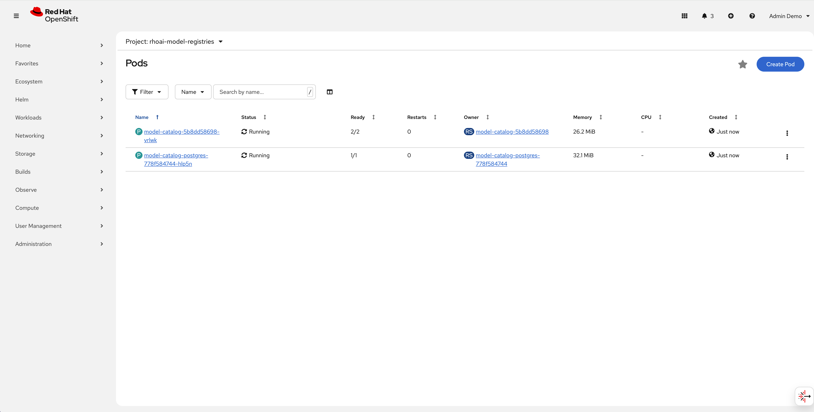
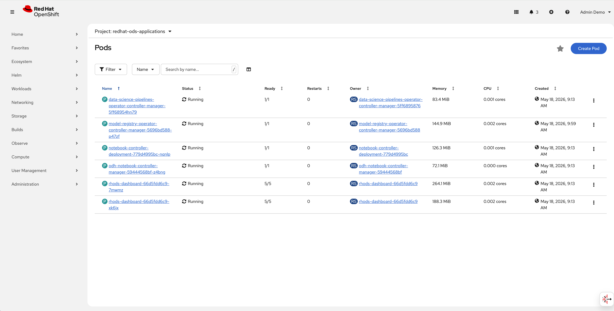

# Component Activation & Configuration

In the previous lab, you established the foundational platform using the Meta-Operator. In this lab, you will dive deeper into the management of the service layer. You will learn how to dynamically activate additional components, manage their lifecycle via the `DataScienceCluster` (DSC) resource, and apply technical troubleshooting logic to identify reconciliation issues.

## Navigating the DataScienceCluster (DSC)

The DSC resource is the "source of truth" for which AI services are active.

1. Log in to the OpenShift Web Console as a `cluster-admin`.
2. Navigate to **Ecosystem** → **Operators** → **Installed Operators** → **Red Hat OpenShift AI** .
3. Click on  **Red Hat OpenShift AI** .
4. Click the **Data Science Cluster** tab.
5. Click the name of your instance (e.g., `default-dsc`).
6. Select the **YAML** tab. This is where we will perform our configurations.

## Activating the Model Registry

The Model Registry is a vital part of the MLOps workflow, acting as a central repository for model metadata, versioning, and tracking.

**Task:** Transition the Model Registry from its initial state to a functional state.

1. In the YAML editor, search for the `modelregistry` component.
2. Change the `managementState` from `Removed` to `Managed`.
3. Ensure the configuration matches the following structure:

   ```yaml
   modelregistry:
     managementState: Managed
     registriesNamespace: rhoai-model-registries

   ```
4. Click  **Save** .
5. **Verification:** * Navigate to **Workloads** → **Pods** in the `rhoai-model-registries` namespace (or your configured application namespace).

   * Confirm that the `model-registry-service` pods initialize and eventually reach a **Running** state



## Lifecycle Management (Resource Removal)

Infrastructure efficiency often requires removing unused services. Observe how the Operator reclaims resources.

**Task:** Temporarily disable a component to observe the Operator's cleanup logic.

1. In the YAML editor for `default-dsc`, locate the `trustyai` component.
2. Change the `managementState` from `Managed` to `Removed`.
3. Click  **Save** .
4. **Verification:** * Navigate to **Workloads** → **Pods** in the `redhat-ods-applications` project.
   * Observe that the `trustyai-service` pods are being terminated and removed.



## Troubleshooting Logic

When a configuration change results in a "Progressing" state that never reaches "Ready," you must apply the following troubleshooting logic.

### Check the Resource Status

Run the following command to see if the Operator has reported specific errors in the DSC status:

```bash
oc get datasciencecluster default-dsc -o yaml

```

Look for the `status.conditions` section. A failed component will typically report a `ReconcileError` or `Ready: False` with a descriptive message.

### Inspect the Meta-Operator Logs

If the status is ambiguous, the Operator logs are the definitive source for debugging:

1. Identify the Operator pod:

   ```bash
   oc get pods -n redhat-ods-operator

   ```
2. Stream the logs to find reconciliation failures:

   ```bash
   oc logs -f deployment/rhods-operator -n redhat-ods-operator

   ```
3. **Key Terms to Search for:** `error`, `failed to create`, `permission denied`, or `retry`.

**Congratulations!** You now have the practical skills to manage the AI platform's component lifecycle and troubleshoot configuration mismatches.
