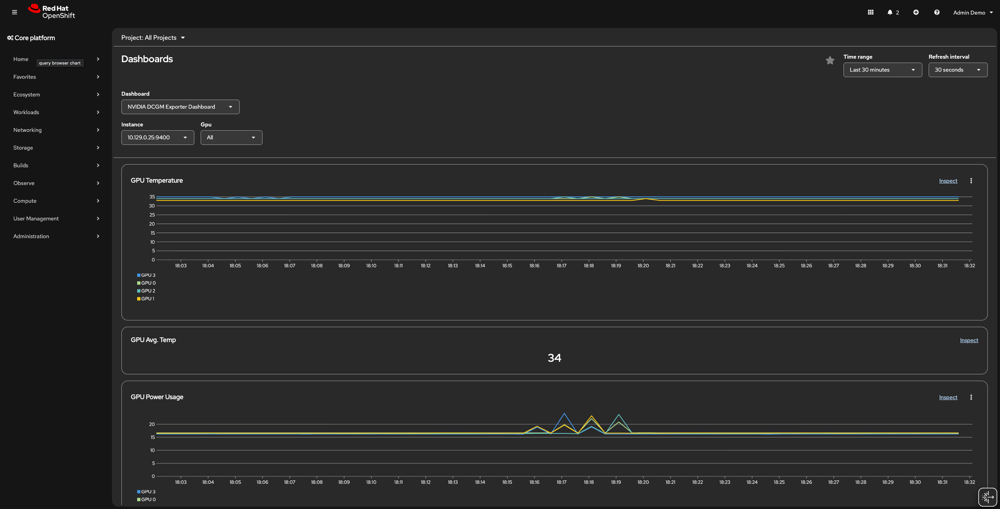

# Enabling Accelerators

Enabling the utilization of these accelerators within a containerized environment, particularly on a platform like Kubernetes or OpenShift, requires a set of foundational components working in concert. The main components for enabling accelerators include:

- Node Feature Discovery (NFD): This component is vital for the initial step of resource identification. NFD detects hardware features on cluster nodes, such as the presence and model of a GPU, and then labels nodes with specific attributes (e.g., feature.node.kubernetes.io/pci-10de.present: true for an NVIDIA device). These labels are crucial for the Kubernetes scheduler to correctly match AI workloads to nodes possessing the necessary hardware.
Kubernetes Machine Management (KMM) / Hardware Driver Management: Before a device can be used, the operating system kernel needs the correct driver. While not explicitly mentioned, KMM or similar mechanisms, often working in conjunction with a dedicated driver operator, ensure that the appropriate kernel modules (drivers) are available and loaded on the nodes where accelerators reside.

- The GPU Provider Operator (e.g., NVIDIA GPU Operator): This operator plays a central management role. It is responsible for automating the lifecycle of the necessary software stack, including the deployment of device drivers and the associated device plugins. The GPU Provider Operator manages hardware drivers and deploys device plugins which are necessary for the Kubernetes kubelet to expose the hardware resources (like [nvidia.com/gpu](https://nvidia.com/gpu)) to the container runtime and, consequently, to user pods. This operator simplifies driver installation, configuration, and kernel module management.

## Node Feature Discovery

The Node Feature Discovery (NFD) Operator orchestrates all resources needed to run the NFD daemon set. As a cluster administrator, you can install the NFD Operator by using the following procedure:

1. Create a namespace for the NFD Operator

```bash
cat << 'EOF' | oc apply -f-
apiVersion: v1
kind: Namespace
metadata:
  name: openshift-nfd
  labels:
    name: openshift-nfd
    openshift.io/cluster-monitoring: "true"
EOF
```

2. Install the NFD OperatorGroup in the namespace you created in the previous step by creating the following objects:

```bash
cat << 'EOF' | oc apply -f-
apiVersion: operators.coreos.com/v1
kind: OperatorGroup
metadata:
  generateName: openshift-nfd-
  name: openshift-nfd
  namespace: openshift-nfd
spec:
  targetNamespaces:
  - openshift-nfd
EOF
```

3. Create the following Subscription CR:

```bash
cat << 'EOF' | oc apply -f-
apiVersion: operators.coreos.com/v1alpha1
kind: Subscription
metadata:
  name: nfd
  namespace: openshift-nfd
spec:
  channel: "stable"
  installPlanApproval: Automatic
  name: nfd
  source: redhat-operators
  sourceNamespace: openshift-marketplace
EOF
```

4. To verify that the Operator deployment is successful, run:

```bash
oc get pods -n openshift-nfd
```

?> A successful deployment shows a Running status

```text
NAME                                      READY   STATUS    RESTARTS   AGE
nfd-controller-manager-7c64df65f4-5mmm6   1/1     Running   0          85s
```

5. Create a NodeFeatureDiscovery CR:

```bash
cat << 'EOF' | oc apply -f-
apiVersion: nfd.openshift.io/v1
kind: NodeFeatureDiscovery
metadata:
  name: nfd-instance
  namespace: openshift-nfd
spec:
  workerConfig:
    configData: |
      core:
      #  labelWhiteList:
      #  noPublish: false
        sleepInterval: 60s
      #  sources: [all]
      #  klog:
      #    addDirHeader: false
      #    alsologtostderr: false
      #    logBacktraceAt:
      #    logtostderr: true
      #    skipHeaders: false
      #    stderrthreshold: 2
      #    v: 0
      #    vmodule:
      ##   NOTE: the following options are not dynamically run-time 
      ##          configurable and require a nfd-worker restart to take effect
      ##          after being changed
      #    logDir:
      #    logFile:
      #    logFileMaxSize: 1800
      #    skipLogHeaders: false
      sources:
      #  cpu:
      #    cpuid:
      ##     NOTE: whitelist has priority over blacklist
      #      attributeBlacklist:
      #        - "BMI1"
      #        - "BMI2"
      #        - "CLMUL"
      #        - "CMOV"
      #        - "CX16"
      #        - "ERMS"
      #        - "F16C"
      #        - "HTT"
      #        - "LZCNT"
      #        - "MMX"
      #        - "MMXEXT"
      #        - "NX"
      #        - "POPCNT"
      #        - "RDRAND"
      #        - "RDSEED"
      #        - "RDTSCP"
      #        - "SGX"
      #        - "SSE"
      #        - "SSE2"
      #        - "SSE3"
      #        - "SSE4.1"
      #        - "SSE4.2"
      #        - "SSSE3"
      #      attributeWhitelist:
      #  kernel:
      #    kconfigFile: "/path/to/kconfig"
      #    configOpts:
      #      - "NO_HZ"
      #      - "X86"
      #      - "DMI"
        pci:
          deviceClassWhitelist:
            - "0200"
            - "03"
            - "12"
          deviceLabelFields:
      #      - "class"
            - "vendor"
      #      - "device"
      #      - "subsystem_vendor"
      #      - "subsystem_device"
      #  usb:
      #    deviceClassWhitelist:
      #      - "0e"
      #      - "ef"
      #      - "fe"
      #      - "ff"
      #    deviceLabelFields:
      #      - "class"
      #      - "vendor"
      #      - "device"
      #  custom:
      #    - name: "my.kernel.feature"
      #      matchOn:
      #        - loadedKMod: ["example_kmod1", "example_kmod2"]
      #    - name: "my.pci.feature"
      #      matchOn:
      #        - pciId:
      #            class: ["0200"]
      #            vendor: ["15b3"]
      #            device: ["1014", "1017"]
      #        - pciId :
      #            vendor: ["8086"]
      #            device: ["1000", "1100"]
      #    - name: "my.usb.feature"
      #      matchOn:
      #        - usbId:
      #          class: ["ff"]
      #          vendor: ["03e7"]
      #          device: ["2485"]
      #        - usbId:
      #          class: ["fe"]
      #          vendor: ["1a6e"]
      #          device: ["089a"]
      #    - name: "my.combined.feature"
      #      matchOn:
      #        - pciId:
      #            vendor: ["15b3"]
      #            device: ["1014", "1017"]
      #          loadedKMod : ["vendor_kmod1", "vendor_kmod2"]
  operand:
    imagePullPolicy: IfNotPresent
    servicePort: 12000
  customConfig:
    configData: |
      #    - name: "more.kernel.features"
      #      matchOn:
      #      - loadedKMod: ["example_kmod3"]
      #    - name: "more.features.by.nodename"
      #      value: customValue
      #      matchOn:
      #      - nodename: ["special-.*-node-.*"]
EOF
```

6. Check that the NodeFeatureDiscovery CR was created by running the following command:

```bash
oc get pods -n openshift-nfd
```

?> A successful deployment shows a Running status

```text
NAME                                      READY   STATUS    RESTARTS   AGE
nfd-controller-manager-7c64df65f4-5mmm6   1/1     Running   0          14m
nfd-gc-67d58d4d5d-z9qtp                   1/1     Running   0          2m
nfd-master-b697bbdb8-pcgfl                1/1     Running   0          2m
nfd-worker-csmds                          1/1     Running   0          2m
```

?> nfd-worker-csmds is created for each worker node 

7. Review the controller-manager pod logs:

```bash
oc logs -n openshift-nfd -l control-plane=controller-manager --tail=1000
```

?> A successful deployment shows similar logs like that

```text
I0504 13:53:12.044142       1 main.go:187] "starting manager" logger="nfd.setup"
I0504 13:53:12.044245       1 server.go:50] "starting server" logger="nfd" kind="health probe" addr="[::]:8082"
I0504 13:53:12.044290       1 server.go:185] "Starting metrics server" logger="nfd.controller-runtime.metrics"
I0504 13:53:12.044309       1 server.go:50] "starting server" logger="nfd" kind="health probe" addr="[::]:8081"
I0504 13:53:12.044463       1 controller.go:178] "Starting EventSource" logger="nfd" controller="nodefeaturerule" controllerGroup="nfd.openshift.io" controllerKind="NodeFeatureRule" source="kind source: *v1alpha1.NodeFeatureRule"
I0504 13:53:12.044515       1 controller.go:186] "Starting Controller" logger="nfd" controller="nodefeaturerule" controllerGroup="nfd.openshift.io" controllerKind="NodeFeatureRule"
I0504 13:53:12.044535       1 leaderelection.go:250] attempting to acquire leader lease openshift-nfd/39f5e5c3.nodefeaturediscoveries.nfd.openshift.io...
I0504 13:53:12.153266       1 controller.go:220] "Starting workers" logger="nfd" controller="nodefeaturerule" controllerGroup="nfd.openshift.io" controllerKind="NodeFeatureRule" worker count=1
I0504 13:53:12.302837       1 server.go:224] "Serving metrics server" logger="nfd.controller-runtime.metrics" bindAddress="127.0.0.1:8080" secure=true
I0504 13:53:28.461923       1 leaderelection.go:260] successfully acquired lease openshift-nfd/39f5e5c3.nodefeaturediscoveries.nfd.openshift.io
I0504 13:53:28.462203       1 controller.go:178] "Starting EventSource" logger="nfd" controller="nodefeaturediscovery" controllerGroup="nfd.openshift.io" controllerKind="NodeFeatureDiscovery" source="kind source: *v1.NodeFeatureDiscovery"
I0504 13:53:28.462258       1 controller.go:178] "Starting EventSource" logger="nfd" controller="nodefeaturediscovery" controllerGroup="nfd.openshift.io" controllerKind="NodeFeatureDiscovery" source="kind source: *v1.Deployment"
I0504 13:53:28.462277       1 controller.go:178] "Starting EventSource" logger="nfd" controller="nodefeaturediscovery" controllerGroup="nfd.openshift.io" controllerKind="NodeFeatureDiscovery" source="kind source: *v1.DaemonSet"
I0504 13:53:28.462285       1 controller.go:178] "Starting EventSource" logger="nfd" controller="nodefeaturediscovery" controllerGroup="nfd.openshift.io" controllerKind="NodeFeatureDiscovery" source="kind source: *v1.ConfigMap"
I0504 13:53:28.462292       1 controller.go:178] "Starting EventSource" logger="nfd" controller="nodefeaturediscovery" controllerGroup="nfd.openshift.io" controllerKind="NodeFeatureDiscovery" source="kind source: *v1.Job"
I0504 13:53:28.462299       1 controller.go:186] "Starting Controller" logger="nfd" controller="nodefeaturediscovery" controllerGroup="nfd.openshift.io" controllerKind="NodeFeatureDiscovery"
I0504 13:53:28.572129       1 controller.go:220] "Starting workers" logger="nfd" controller="nodefeaturediscovery" controllerGroup="nfd.openshift.io" controllerKind="NodeFeatureDiscovery" worker count=1
```

8. Review the nfd-worker pod logs:

```bash
oc logs -n openshift-nfd -l app=nfd-worker --tail=1000
```

?> A successful deployment shows a similar output

```text
I0504 14:06:53.235666       1 main.go:59] "version not set! Set -ldflags \"-X github.com/openshift/node-feature-discovery/pkg/version.version=`git describe --tags --dirty --always --match 'v*'`\" during build or run."
I0504 14:06:53.236375       1 nfd-worker.go:294] "Node Feature Discovery Worker" version="undefined" nodeName="ip-10-0-29-250.us-east-2.compute.internal" namespace="openshift-nfd"
I0504 14:06:53.236657       1 nfd-worker.go:493] "configuration file parsed" path="/etc/kubernetes/node-feature-discovery/nfd-worker.conf"
I0504 14:06:53.244298       1 nfd-worker.go:528] "configuration successfully updated" configuration={"Core":{"Klog":{},"LabelWhiteList":"","NoPublish":false,"NoOwnerRefs":false,"FeatureSources":["all"],"Sources":null,"LabelSources":["all"],"SleepInterval":{"Duration":60000000000}},"Sources":{"cpu":{"cpuid":{"attributeBlacklist":["AVX10","BMI1","BMI2","CLMUL","CMOV","CX16","ERMS","F16C","HTT","LZCNT","MMX","MMXEXT","NX","POPCNT","RDRAND","RDSEED","RDTSCP","SGX","SGXLC","SSE","SSE2","SSE3","SSE4","SSE42","SSSE3","TDX_GUEST"]}},"custom":[],"fake":{"labels":{"fakefeature1":"true","fakefeature2":"true","fakefeature3":"true"},"flagFeatures":["flag_1","flag_2","flag_3"],"attributeFeatures":{"attr_1":"true","attr_2":"false","attr_3":"10"},"instanceFeatures":[{"attr_1":"true","attr_2":"false","attr_3":"10","attr_4":"foobar","name":"instance_1"},{"attr_1":"true","attr_2":"true","attr_3":"100","name":"instance_2"},{"name":"instance_3"}]},"kernel":{"KconfigFile":"","configOpts":["NO_HZ","NO_HZ_IDLE","NO_HZ_FULL","PREEMPT"]},"local":{},"pci":{"deviceClassWhitelist":["0200","03","12"],"deviceLabelFields":["vendor"]},"usb":{"deviceClassWhitelist":["0e","ef","fe","ff"],"deviceLabelFields":["class","vendor","device"]}}}
E0504 14:06:53.250001       1 memory.go:112] "failed to detect Swap nodes" err="failed to read swaps file: open /host-proc/swaps: no such file or directory"
I0504 14:06:53.274199       1 nfd-worker.go:538] "starting feature discovery..."
I0504 14:06:53.274435       1 nfd-worker.go:551] "feature discovery completed"
```

9. Finally, review the different labels in the node:

```bash
oc get nodes
oc get node <NODE_NAME>  -o jsonpath='{.metadata.labels}' | jq '.'
```

?> A successful deployment shows a similar output

```json
{
  "beta.kubernetes.io/arch": "amd64",
  "beta.kubernetes.io/instance-type": "g6.12xlarge",
  "beta.kubernetes.io/os": "linux",
  "failure-domain.beta.kubernetes.io/region": "us-east-2",
  "failure-domain.beta.kubernetes.io/zone": "us-east-2b",
  "feature.node.kubernetes.io/cpu-cpuid.ADX": "true",
  "feature.node.kubernetes.io/cpu-cpuid.AESNI": "true",
  "feature.node.kubernetes.io/cpu-cpuid.AVX": "true",
  "feature.node.kubernetes.io/cpu-cpuid.AVX2": "true",
  "feature.node.kubernetes.io/cpu-cpuid.CLZERO": "true",
  "feature.node.kubernetes.io/cpu-cpuid.CMPXCHG8": "true",
  "feature.node.kubernetes.io/cpu-cpuid.EFER_LMSLE_UNS": "true",
  "feature.node.kubernetes.io/cpu-cpuid.FMA3": "true",
  "feature.node.kubernetes.io/cpu-cpuid.FP256": "true",
  "feature.node.kubernetes.io/cpu-cpuid.FXSR": "true",
  "feature.node.kubernetes.io/cpu-cpuid.FXSROPT": "true",
  "feature.node.kubernetes.io/cpu-cpuid.HYPERVISOR": "true",
  "feature.node.kubernetes.io/cpu-cpuid.IBPB": "true",
  "feature.node.kubernetes.io/cpu-cpuid.IBPB_BRTYPE": "true",
  "feature.node.kubernetes.io/cpu-cpuid.IBRS": "true",
  "feature.node.kubernetes.io/cpu-cpuid.IBRS_PREFERRED": "true",
  "feature.node.kubernetes.io/cpu-cpuid.IBRS_PROVIDES_SMP": "true",
  "feature.node.kubernetes.io/cpu-cpuid.LAHF": "true",
  "feature.node.kubernetes.io/cpu-cpuid.MCOMMIT": "true",
  "feature.node.kubernetes.io/cpu-cpuid.MOVBE": "true",
  "feature.node.kubernetes.io/cpu-cpuid.MOVU": "true",
  "feature.node.kubernetes.io/cpu-cpuid.OSXSAVE": "true",
  "feature.node.kubernetes.io/cpu-cpuid.PSFD": "true",
  "feature.node.kubernetes.io/cpu-cpuid.RDPRU": "true",
  "feature.node.kubernetes.io/cpu-cpuid.SBPB": "true",
  "feature.node.kubernetes.io/cpu-cpuid.SHA": "true",
  "feature.node.kubernetes.io/cpu-cpuid.SPEC_CTRL_SSBD": "true",
  "feature.node.kubernetes.io/cpu-cpuid.SSE4A": "true",
  "feature.node.kubernetes.io/cpu-cpuid.STIBP": "true",
  "feature.node.kubernetes.io/cpu-cpuid.STIBP_ALWAYSON": "true",
  "feature.node.kubernetes.io/cpu-cpuid.SYSCALL": "true",
  "feature.node.kubernetes.io/cpu-cpuid.SYSEE": "true",
  "feature.node.kubernetes.io/cpu-cpuid.TOPEXT": "true",
  "feature.node.kubernetes.io/cpu-cpuid.TSA_VERW_CLEAR": "true",
  "feature.node.kubernetes.io/cpu-cpuid.VAES": "true",
  "feature.node.kubernetes.io/cpu-cpuid.VPCLMULQDQ": "true",
  "feature.node.kubernetes.io/cpu-cpuid.WBNOINVD": "true",
  "feature.node.kubernetes.io/cpu-cpuid.X87": "true",
  "feature.node.kubernetes.io/cpu-cpuid.XGETBV1": "true",
  "feature.node.kubernetes.io/cpu-cpuid.XSAVE": "true",
  "feature.node.kubernetes.io/cpu-cpuid.XSAVEC": "true",
  "feature.node.kubernetes.io/cpu-cpuid.XSAVEOPT": "true",
  "feature.node.kubernetes.io/cpu-hardware_multithreading": "true",
  "feature.node.kubernetes.io/cpu-model.family": "25",
  "feature.node.kubernetes.io/cpu-model.id": "1",
  "feature.node.kubernetes.io/cpu-model.vendor_id": "AMD",
  "feature.node.kubernetes.io/kernel-config.NO_HZ": "true",
  "feature.node.kubernetes.io/kernel-config.NO_HZ_FULL": "true",
  "feature.node.kubernetes.io/kernel-selinux.enabled": "true",
  "feature.node.kubernetes.io/kernel-version.full": "5.14.0-570.107.1.el9_6.x86_64",
  "feature.node.kubernetes.io/kernel-version.major": "5",
  "feature.node.kubernetes.io/kernel-version.minor": "14",
  "feature.node.kubernetes.io/kernel-version.revision": "0",
  "feature.node.kubernetes.io/pci-10de.present": "true",
  "feature.node.kubernetes.io/pci-1d0f.present": "true",
  "feature.node.kubernetes.io/rdma.available": "true",
  "feature.node.kubernetes.io/storage-nonrotationaldisk": "true",
  "feature.node.kubernetes.io/system-os_release.ID": "rhel",
  "feature.node.kubernetes.io/system-os_release.OPENSHIFT_VERSION": "4.21",
  "feature.node.kubernetes.io/system-os_release.OSTREE_VERSION": "9.6.20260414-0",
  "feature.node.kubernetes.io/system-os_release.VERSION_ID": "9.6",
  "feature.node.kubernetes.io/system-os_release.VERSION_ID.major": "9",
  "feature.node.kubernetes.io/system-os_release.VERSION_ID.minor": "6",
  "kubernetes.io/arch": "amd64",
  "kubernetes.io/hostname": "ip-10-0-61-106.us-east-2.compute.internal",
  "kubernetes.io/os": "linux",
  "node-role.kubernetes.io/worker": "",
  "node.kubernetes.io/instance-type": "g6.12xlarge",
  "node.openshift.io/os_id": "rhel",
  "topology.ebs.csi.aws.com/zone": "us-east-2b",
  "topology.k8s.aws/zone-id": "use2-az2",
  "topology.kubernetes.io/region": "us-east-2",
  "topology.kubernetes.io/zone": "us-east-2b"
}
```


## GPU Operator

Before you can use NVIDIA GPUs in OpenShift AI, you must install the NVIDIA GPU Operator. Additionally, meeting the following prerequisites is essential:

- You have logged in to your OpenShift cluster.
- You have the cluster-admin role in your OpenShift cluster.
- You have installed an NVIDIA GPU and confirmed that it is detected in your environment.

As a cluster administrator, you can install the NVIDIA GPU Operator using the OpenShift CLI (oc).

1. Create a namespace for the NVIDIA GPU Operator:

```bash
cat << 'EOF' | oc apply -f-
apiVersion: v1
kind: Namespace
metadata:
  name: nvidia-gpu-operator
  labels:
    name: nvidia-gpu-operator
    openshift.io/cluster-monitoring: "true"
EOF
```

2. Install the NVIDIA GPU OperatorGroup in the namespace you created in the previous step by creating the following objects:

```bash
cat << 'EOF' | oc apply -f-
apiVersion: operators.coreos.com/v1
kind: OperatorGroup
metadata:
  name: nvidia-gpu-operator-group
  namespace: nvidia-gpu-operator
spec:
  targetNamespaces:
  - nvidia-gpu-operator
EOF
```

3. Create the following Subscription CR:

```bash
CHANNEL=$(oc get packagemanifest gpu-operator-certified -n openshift-marketplace -o jsonpath='{.status.defaultChannel}')
STARTING_CSV=$(oc get packagemanifests/gpu-operator-certified -n openshift-marketplace -ojson | jq -r '.status.channels[] | select(.name == "'$CHANNEL'") | .currentCSV')
cat << EOF | oc apply -f-
apiVersion: operators.coreos.com/v1alpha1
kind: Subscription
metadata:
  name: gpu-operator-certified
  namespace: nvidia-gpu-operator
spec:
  channel: $CHANNEL
  installPlanApproval: Automatic
  name: gpu-operator-certified
  source: certified-operators
  sourceNamespace: openshift-marketplace
  startingCSV: $STARTING_CSV
EOF
```

4. To verify that the Operator deployment is successful, run:

```bash
oc get pods -n nvidia-gpu-operator
```

?> A successful deployment shows a Running status

```text
NAME                            READY   STATUS    RESTARTS   AGE
gpu-operator-5b47d6cd6b-lqcrh   1/1     Running   0          8m25s
```

5. Create a clusterpolicy.json file using the default config:

```bash
CHANNEL=$(oc get packagemanifest gpu-operator-certified -n openshift-marketplace -o jsonpath='{.status.defaultChannel}')
STARTING_CSV=$(oc get packagemanifests/gpu-operator-certified -n openshift-marketplace -ojson | jq -r '.status.channels[] | select(.name == "'$CHANNEL'") | .currentCSV')
oc get csv -n nvidia-gpu-operator $STARTING_CSV -o jsonpath='{.metadata.annotations.alm-examples}' | jq '.[0]' > /tmp/clusterpolicy.json
```

?> You can see an example in the following [link](2-accelerators-integration/_clusterpolicy-example.md)

6. Modify the clusterpolicy.json file to specify the following configuration aspects:

```bash
vi /tmp/clusterpolicy.json
"driver": {
     "repository": "nvcr.io/nvidia",
     "image": "driver",
     "version": "570.172.08"
}
```

7. Apply the cluster policy file:

```bash
oc apply -f /tmp/clusterpolicy.json
```


8. To verify that the Operator deployment is successful, run:

```bash
oc get pods -n nvidia-gpu-operator
```

?> A successful deployment shows a Running status

```text
NAME                            READY   STATUS    RESTARTS   AGE
gpu-feature-discovery-2bwt6                    1/1     Running     0               8m15s
gpu-operator-6d8475969f-245wl                  1/1     Running     0               10m
nvidia-container-toolkit-daemonset-2hbq8       1/1     Running     0               8m15s
nvidia-cuda-validator-97qdx                    0/1     Completed   0               3m51s
nvidia-dcgm-exporter-k4sht                     1/1     Running     2 (3m26s ago)   8m15s
nvidia-dcgm-nczv4                              1/1     Running     0               8m15s
nvidia-device-plugin-daemonset-v6rrc           1/1     Running     0               8m15s
nvidia-driver-daemonset-9.6.20260414-0-9zt8p   2/2     Running     0               8m24s
nvidia-node-status-exporter-7b7j6              1/1     Running     0               8m21s
nvidia-operator-validator-rkc7f                1/1     Running     0               8m15s
```

?>gpu-feature-discovery, nvidia-device-plugin-daemonset, nvidia-node-status-exporter, nvidia-dcgm, nvidia-dcgm-exporter and nvidia-operator-validator are created for each worker node 

9. Review the nfd-worker pod logs:

```bash
oc logs -n openshift-nfd -l app=nfd-worker --tail=1000
```

?> A successful deployment shows a similar output

```text
I0505 13:11:07.447011       1 nfd-worker.go:667] "updating NodeFeature object" nodefeature="openshift-nfd/ip-10-0-15-11.us-east-2.compute.internal"
```

10. Review the nvidia components pods logs:

**gpu-feature-discovery**: Interacting directly with the NVIDIA software components to identify and expose the highly specific characteristics of the GPUs via labels

```bash
oc logs -n nvidia-gpu-operator -l app=gpu-feature-discovery --tail=1000
```

```text
...
I0505 13:15:32.765284       1 factory.go:58] Using NVML manager
I0505 13:15:32.765316       1 main.go:214] Start running
2026/05/05 13:15:32 WARNING: unable to detect IOMMU FD for [0000:38:00.0 open /sys/bus/pci/devices/0000:38:00.0/vfio-dev: no such file or directory]: %!v(MISSING)
2026/05/05 13:15:32 WARNING: unable to detect IOMMU FD for [0000:3a:00.0 open /sys/bus/pci/devices/0000:3a:00.0/vfio-dev: no such file or directory]: %!v(MISSING)
2026/05/05 13:15:32 WARNING: unable to detect IOMMU FD for [0000:3c:00.0 open /sys/bus/pci/devices/0000:3c:00.0/vfio-dev: no such file or directory]: %!v(MISSING)
2026/05/05 13:15:32 WARNING: unable to detect IOMMU FD for [0000:3e:00.0 open /sys/bus/pci/devices/0000:3e:00.0/vfio-dev: no such file or directory]: %!v(MISSING)
I0505 13:15:32.904196       1 main.go:281] Creating Labels
I0505 13:15:32.904223       1 output.go:91] Writing labels to output file /etc/kubernetes/node-feature-discovery/features.d/gfd
...
```

**nvidia-device-plugin-daemonset**: Exposing the physical GPU hardware to the cluster

```bash
oc logs -n nvidia-gpu-operator -l app=nvidia-device-plugin-daemonset --tail=1000
```

```text
...
time="2026-05-05T13:15:33Z" level=info msg="Using driver version 570.172.08"
...
I0505 13:15:33.892866       1 server.go:198] Starting GRPC server for 'nvidia.com/gpu'
I0505 13:15:33.894335       1 server.go:142] Starting to serve 'nvidia.com/gpu' on /var/lib/kubelet/device-plugins/nvidia-gpu.sock
I0505 13:15:33.896883       1 server.go:149] Registered device plugin for 'nvidia.com/gpu' with Kubelet
...
```

**nvidia-node-status-exporter**: Exporting status information about the NVIDIA GPUs on the host node

```bash
oc logs -n nvidia-gpu-operator -l app=nvidia-node-status-exporter --tail=1000
```

```text
...
time="2026-05-05T13:15:55Z" level=info msg="metrics: StatusFile: 'plugin-ready' is ready"
time="2026-05-05T13:15:55Z" level=info msg="Attempting to validate a pre-installed driver on the host"
time="2026-05-05T13:15:55Z" level=info msg="metrics: StatusFile: 'cuda-ready' is ready"
time="2026-05-05T13:15:55Z" level=info msg="No pre-installed driver detected on the host: no 'nvidia-smi' file present on the host: lstat /host/usr/bin/nvidia-smi: no such file or directory"
time="2026-05-05T13:15:55Z" level=info msg="Validating containerized driver installation"
time="2026-05-05T13:15:55Z" level=info msg="Driver is not pre-installed on the host and is managed by GPU Operator. Checking driver container status."
time="2026-05-05T13:15:55Z" level=info msg="Attempting to validate a driver container installation"
time="2026-05-05T13:15:55Z" level=info msg="metrics: DevicePlugin validation: found 4 GPUs exposed by the DevicePlugin"
...
```

11. Finally, review again the lables defined for the node with all the GPU configuration included:

```bash
oc get nodes
oc get node <NODE_NAME>  -o jsonpath='{.metadata.labels}' | jq '.'
```

?> A successful deployment shows a similar output


```json
{
  "beta.kubernetes.io/arch": "amd64",
  "beta.kubernetes.io/instance-type": "g6.12xlarge",
  "beta.kubernetes.io/os": "linux",
  "failure-domain.beta.kubernetes.io/region": "us-east-2",
  "failure-domain.beta.kubernetes.io/zone": "us-east-2b",
  "feature.node.kubernetes.io/cpu-cpuid.ADX": "true",
  "feature.node.kubernetes.io/cpu-cpuid.AESNI": "true",
  "feature.node.kubernetes.io/cpu-cpuid.AVX": "true",
  "feature.node.kubernetes.io/cpu-cpuid.AVX2": "true",
  "feature.node.kubernetes.io/cpu-cpuid.CLZERO": "true",
  "feature.node.kubernetes.io/cpu-cpuid.CMPXCHG8": "true",
  "feature.node.kubernetes.io/cpu-cpuid.EFER_LMSLE_UNS": "true",
  "feature.node.kubernetes.io/cpu-cpuid.FMA3": "true",
  "feature.node.kubernetes.io/cpu-cpuid.FP256": "true",
  "feature.node.kubernetes.io/cpu-cpuid.FXSR": "true",
  "feature.node.kubernetes.io/cpu-cpuid.FXSROPT": "true",
  "feature.node.kubernetes.io/cpu-cpuid.HYPERVISOR": "true",
  "feature.node.kubernetes.io/cpu-cpuid.IBPB": "true",
  "feature.node.kubernetes.io/cpu-cpuid.IBPB_BRTYPE": "true",
  "feature.node.kubernetes.io/cpu-cpuid.IBRS": "true",
  "feature.node.kubernetes.io/cpu-cpuid.IBRS_PREFERRED": "true",
  "feature.node.kubernetes.io/cpu-cpuid.IBRS_PROVIDES_SMP": "true",
  "feature.node.kubernetes.io/cpu-cpuid.LAHF": "true",
  "feature.node.kubernetes.io/cpu-cpuid.MCOMMIT": "true",
  "feature.node.kubernetes.io/cpu-cpuid.MOVBE": "true",
  "feature.node.kubernetes.io/cpu-cpuid.MOVU": "true",
  "feature.node.kubernetes.io/cpu-cpuid.OSXSAVE": "true",
  "feature.node.kubernetes.io/cpu-cpuid.PSFD": "true",
  "feature.node.kubernetes.io/cpu-cpuid.RDPRU": "true",
  "feature.node.kubernetes.io/cpu-cpuid.SBPB": "true",
  "feature.node.kubernetes.io/cpu-cpuid.SHA": "true",
  "feature.node.kubernetes.io/cpu-cpuid.SPEC_CTRL_SSBD": "true",
  "feature.node.kubernetes.io/cpu-cpuid.SSE4A": "true",
  "feature.node.kubernetes.io/cpu-cpuid.STIBP": "true",
  "feature.node.kubernetes.io/cpu-cpuid.STIBP_ALWAYSON": "true",
  "feature.node.kubernetes.io/cpu-cpuid.SYSCALL": "true",
  "feature.node.kubernetes.io/cpu-cpuid.SYSEE": "true",
  "feature.node.kubernetes.io/cpu-cpuid.TOPEXT": "true",
  "feature.node.kubernetes.io/cpu-cpuid.TSA_VERW_CLEAR": "true",
  "feature.node.kubernetes.io/cpu-cpuid.VAES": "true",
  "feature.node.kubernetes.io/cpu-cpuid.VPCLMULQDQ": "true",
  "feature.node.kubernetes.io/cpu-cpuid.WBNOINVD": "true",
  "feature.node.kubernetes.io/cpu-cpuid.X87": "true",
  "feature.node.kubernetes.io/cpu-cpuid.XGETBV1": "true",
  "feature.node.kubernetes.io/cpu-cpuid.XSAVE": "true",
  "feature.node.kubernetes.io/cpu-cpuid.XSAVEC": "true",
  "feature.node.kubernetes.io/cpu-cpuid.XSAVEOPT": "true",
  "feature.node.kubernetes.io/cpu-hardware_multithreading": "true",
  "feature.node.kubernetes.io/cpu-model.family": "25",
  "feature.node.kubernetes.io/cpu-model.id": "1",
  "feature.node.kubernetes.io/cpu-model.vendor_id": "AMD",
  "feature.node.kubernetes.io/kernel-config.NO_HZ": "true",
  "feature.node.kubernetes.io/kernel-config.NO_HZ_FULL": "true",
  "feature.node.kubernetes.io/kernel-selinux.enabled": "true",
  "feature.node.kubernetes.io/kernel-version.full": "5.14.0-570.107.1.el9_6.x86_64",
  "feature.node.kubernetes.io/kernel-version.major": "5",
  "feature.node.kubernetes.io/kernel-version.minor": "14",
  "feature.node.kubernetes.io/kernel-version.revision": "0",
  "feature.node.kubernetes.io/pci-10de.present": "true", <--------------- IMPORTANT - NFD Operator
  "feature.node.kubernetes.io/pci-1d0f.present": "true", <--------------- IMPORTANT - NFD Operator
  "feature.node.kubernetes.io/rdma.available": "true",
  "feature.node.kubernetes.io/storage-nonrotationaldisk": "true",
  "feature.node.kubernetes.io/system-os_release.ID": "rhel",
  "feature.node.kubernetes.io/system-os_release.OPENSHIFT_VERSION": "4.21",
  "feature.node.kubernetes.io/system-os_release.OSTREE_VERSION": "9.6.20260414-0",
  "feature.node.kubernetes.io/system-os_release.VERSION_ID": "9.6",
  "feature.node.kubernetes.io/system-os_release.VERSION_ID.major": "9",
  "feature.node.kubernetes.io/system-os_release.VERSION_ID.minor": "6",
  "kubernetes.io/arch": "amd64",
  "kubernetes.io/hostname": "ip-10-0-61-106.us-east-2.compute.internal",
  "kubernetes.io/os": "linux",
  "node-role.kubernetes.io/worker": "",
  "node.kubernetes.io/instance-type": "g6.12xlarge",
  "node.openshift.io/os_id": "rhel",
  "nvidia.com/cuda.driver-version.full": "570.172.08",
  "nvidia.com/cuda.driver-version.major": "570",
  "nvidia.com/cuda.driver-version.minor": "172",
  "nvidia.com/cuda.driver-version.revision": "08",
  "nvidia.com/cuda.driver.major": "570",
  "nvidia.com/cuda.driver.minor": "172",
  "nvidia.com/cuda.driver.rev": "08",
  "nvidia.com/cuda.runtime-version.full": "12.8",
  "nvidia.com/cuda.runtime-version.major": "12",
  "nvidia.com/cuda.runtime-version.minor": "8",
  "nvidia.com/cuda.runtime.major": "12",
  "nvidia.com/cuda.runtime.minor": "8",
  "nvidia.com/gfd.timestamp": "1777986932",
  "nvidia.com/gpu-driver-upgrade-state": "upgrade-done",
  "nvidia.com/gpu.compute.major": "8",
  "nvidia.com/gpu.compute.minor": "9",
  "nvidia.com/gpu.count": "4",  <--------------- IMPORTANT - GPU Feature Discovery (GFD)
  "nvidia.com/gpu.deploy.container-toolkit": "true",
  "nvidia.com/gpu.deploy.dcgm": "true",
  "nvidia.com/gpu.deploy.dcgm-exporter": "true",
  "nvidia.com/gpu.deploy.device-plugin": "true",
  "nvidia.com/gpu.deploy.driver": "true",
  "nvidia.com/gpu.deploy.gpu-feature-discovery": "true",
  "nvidia.com/gpu.deploy.node-status-exporter": "true",
  "nvidia.com/gpu.deploy.nvsm": "",
  "nvidia.com/gpu.deploy.operator-validator": "true",
  "nvidia.com/gpu.family": "ada-lovelace",  <--------------- IMPORTANT - GPU Feature Discovery (GFD)
  "nvidia.com/gpu.machine": "g6.12xlarge",
  "nvidia.com/gpu.memory": "23034",
  "nvidia.com/gpu.mode": "compute",
  "nvidia.com/gpu.present": "true",       <--------------- IMPORTANT - GPU Feature Discovery (GFD)
  "nvidia.com/gpu.product": "NVIDIA-L4",  <--------------- IMPORTANT - GPU Feature Discovery (GFD)
  "nvidia.com/gpu.replicas": "1",
  "nvidia.com/gpu.sharing-strategy": "none",
  "nvidia.com/mig.capable": "false",
  "nvidia.com/mig.strategy": "single",
  "nvidia.com/mps.capable": "false",
  "nvidia.com/vgpu.present": "false",
  "topology.ebs.csi.aws.com/zone": "us-east-2b",
  "topology.k8s.aws/zone-id": "use2-az2",
  "topology.kubernetes.io/region": "us-east-2",
  "topology.kubernetes.io/zone": "us-east-2b"
}
```

The cluster is now fully configured and optimized with the necessary NVIDIA drivers, resource management tools, and runtime support to effectively utilize NVIDIA GPUs. This comprehensive readiness ensures a robust platform capable of deploying and scaling a wide range of GPU-accelerated workloads, including Deep Learning, HPC, and data analytics.

## Monitoring GPUs

The GPU Operator exposes GPU telemetry for Prometheus by using the NVIDIA DCGM Exporter. These metrics can be visualized using a monitoring dashboard based on Grafana.

1. Download the latest NVIDIA DCGM Exporter Dashboard from the DCGM Exporter repository on GitHub:

```bash
curl -LfO https://github.com/NVIDIA/dcgm-exporter/raw/main/grafana/dcgm-exporter-dashboard.json
```

?> You can see an example in the following [link](2-accelerators-integration/_dcgm-exporter-dashboard.md)

2. Create a config map from the downloaded file in the openshift-config-managed namespace:

```bash
oc create configmap nvidia-dcgm-exporter-dashboard -n openshift-config-managed --from-file=dcgm-exporter-dashboard.json
```

3. Label the config map to expose the dashboard in the Administrator perspective of the web console:

```bash
oc label configmap nvidia-dcgm-exporter-dashboard -n openshift-config-managed "console.openshift.io/dashboard=true"
```

4. Verify the new dashboard in the OpenShift Container Platform web console navigating to **Observe -> Dashboards** and select NVIDIA DCGM Exporter Dashboard from the Dashboard list.



