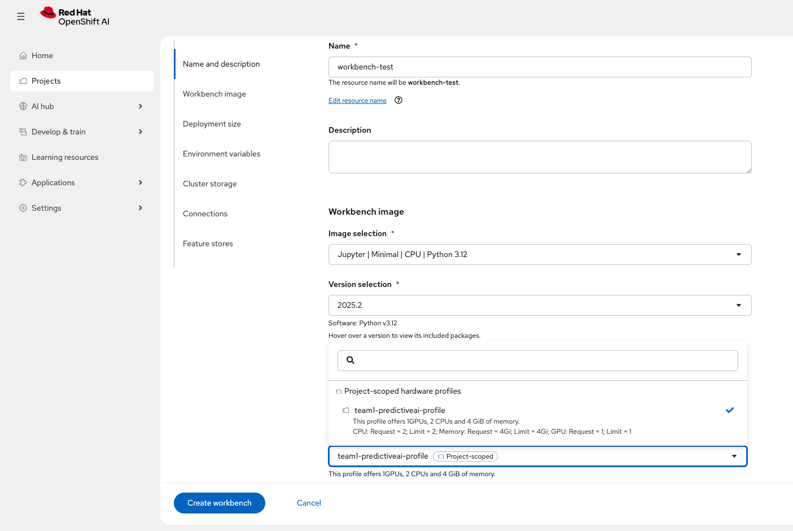
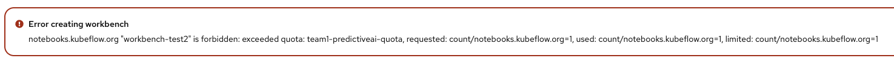

# 👨🏼‍💻 GPU As A Service

GPU-as-a-Service is a fundamental approach for maximizing the efficiency and security of specialized AI hardware. It facilitates secure and effective multi-tenancy by centralizing resources and utilizing advanced scheduling mechanisms.

- Hardware Profiles / Resource Allocation: Once the hardware is detected and the drivers/plugins are in place, workloads need a mechanism to request and utilize these resources. Hardware Profiles (often implemented via Custom Resource Definitions or configuration within the accelerator operator) facilitate the allocation of specific accelerator resources for AI workloads. This ensures that different types of workloads (e.g., a massive training job requiring multiple high-end GPUs versus a small inference service needing a fraction of a single GPU) can be scheduled and run efficiently with guaranteed resource access. This mechanism is crucial for multi-tenancy and resource governance in an AI/ML platform.

- GPU Time Slicing or Multi-Instance GPU (MIG): These techniques enables effective sharing of a single physical GPU by dynamically alternating processing time slots among different workloads or, MIG, offering superior resource and fault isolation by providing hardware-based partitioning of the GPU.

- Enhanced Scheduling: Intelligent scheduling tools like Kueue further optimize resource management. Kueue actively manages resource quotas and prioritizes mission-critical workloads, ensuring optimal utilization and guaranteed access for a diverse range of AI/ML tasks.

## Intelligent GPU Orchestration

A key strategy is needed to prevent non-AI workloads from inadvertently using GPU nodes, while also allowing users to select specific hardware profiles (such as an NVIDIA L4 or A100) to match their model's computational demands. Red Hat OpenShift, together with Red Hat OpenShift AI, provides the necessary mechanisms—including node taints, tolerations, custom labels and hardware profiles to define and enforce a solution for this challenge.

The following procedure implement this strategy creating the required resources in the Openshift cluster:

1. First of all, it is required to reserve the worker nodes with GPUs for only AI workloads. For this goal, it is required to create the following taints:

```bash
oc get nodes
oc adm taint node <NODE_NAME> ai/workloads=Exists:NoSchedule --overwrite 
```

!> If any pod related to the NVIDIA operator is restarted, then it couldn't start again because of this tains. It is possible to try...😋
 
2. Modify the NVIDIA ClusterPolicy to include the respective tolerations in the pods deployed by the operator:

```bash
oc patch clusterpolicy gpu-cluster-policy -n nvidia-gpu-operator --type=merge -p '
{
  "spec": {
    "daemonsets": {
      "tolerations": [
        {
          "key": "ai/workloads",
          "operator": "Exists",
          "effect": "NoSchedule"
        }
      ]
    }
  }
}
'
```

Verify that the daemonsets are now running on the tainted node:

```bash
oc get pods -n nvidia-gpu-operator -o wide -w
```

!> All pods should be restarted to change tolerations in their definition

```text
NAME                                           READY   STATUS      RESTARTS   AGE   IP            NODE                                        NOMINATED NODE   READINESS GATES
gpu-feature-discovery-gp8bp                    0/1     Init:0/1    0          42s   10.129.0.33   ip-10-0-15-196.us-east-2.compute.internal   <none>           <none>
gpu-operator-6d8475969f-lbfwl                  1/1     Running     0          21m   10.129.0.10   ip-10-0-15-196.us-east-2.compute.internal   <none>           <none>
nvidia-container-toolkit-daemonset-vrxt7       0/1     Init:0/1    0          42s   10.129.0.37   ip-10-0-15-196.us-east-2.compute.internal   <none>           <none>
nvidia-cuda-validator-vm4fq                    0/1     Completed   0          14m   10.129.0.25   ip-10-0-15-196.us-east-2.compute.internal   <none>           <none>
nvidia-dcgm-exporter-gz42l                     0/1     Init:0/1    0          42s   10.129.0.35   ip-10-0-15-196.us-east-2.compute.internal   <none>           <none>
nvidia-dcgm-zbznf                              0/1     Init:0/1    0          42s   10.129.0.36   ip-10-0-15-196.us-east-2.compute.internal   <none>           <none>
nvidia-device-plugin-daemonset-gpkm6           0/1     Init:0/1    0          42s   10.129.0.34   ip-10-0-15-196.us-east-2.compute.internal   <none>           <none>
nvidia-driver-daemonset-9.6.20260420-0-nmwmw   1/2     Running     0          89s   10.129.0.32   ip-10-0-15-196.us-east-2.compute.internal   <none>           <none>
nvidia-node-status-exporter-cffd5              1/1     Running     0          90s   10.129.0.31   ip-10-0-15-196.us-east-2.compute.internal   <none>           <none>
nvidia-operator-validator-kb9dm                0/1     Init:0/4    0          42s   10.129.0.38   ip-10-0-15-196.us-east-2.compute.internal   <none>           <none>
```

?> A successful deployment shows a Running status after some minutes

```text
gpu-feature-discovery-gp8bp                    1/1     Running     0               4m34s   10.129.0.33   ip-10-0-15-196.us-east-2.compute.internal   <none>           <none>
gpu-operator-6d8475969f-lbfwl                  1/1     Running     0               25m     10.129.0.10   ip-10-0-15-196.us-east-2.compute.internal   <none>           <none>
nvidia-container-toolkit-daemonset-vrxt7       1/1     Running     0               4m34s   10.129.0.37   ip-10-0-15-196.us-east-2.compute.internal   <none>           <none>
nvidia-cuda-validator-r947z                    0/1     Completed   1               2m23s   10.129.0.39   ip-10-0-15-196.us-east-2.compute.internal   <none>           <none>
nvidia-dcgm-exporter-gz42l                     0/1     Running     1 (2m17s ago)   4m34s   10.129.0.35   ip-10-0-15-196.us-east-2.compute.internal   <none>           <none>
nvidia-dcgm-zbznf                              1/1     Running     0               4m34s   10.129.0.36   ip-10-0-15-196.us-east-2.compute.internal   <none>           <none>
nvidia-device-plugin-daemonset-gpkm6           1/1     Running     0               4m34s   10.129.0.34   ip-10-0-15-196.us-east-2.compute.internal   <none>           <none>
nvidia-driver-daemonset-9.6.20260420-0-nmwmw   2/2     Running     0               5m21s   10.129.0.32   ip-10-0-15-196.us-east-2.compute.internal   <none>           <none>
nvidia-node-status-exporter-cffd5              1/1     Running     0               5m22s   10.129.0.31   ip-10-0-15-196.us-east-2.compute.internal   <none>           <none>
nvidia-operator-validator-kb9dm                1/1     Running     0               4m34s   10.129.0.38   ip-10-0-15-196.us-east-2.compute.internal   <none>           <none>
```

Now, the cluster is ready for reserving the GPUs resources only for AI workloads. Then, it is time for sharing the NVIDIA GPUs for multiple customers defining an orchestration limiting strategy in the different Data Science projects.

The following "use case" will be our reference for implementing a control policy:

- **Team 1** - PredictiveAI Project is Allowed to use only 1 GPU.
- **Team 2** - GenAI Project is Allowed to use 3 GPUs.

For implementing this control policy, it is time to follow the next procedure:

1. Create the Data Science Projects

**team1-predictiveai**

```bash
cat << 'EOF' | oc apply -f-
apiVersion: v1
kind: Namespace
metadata:
  name: team1-predictiveai
  labels:
    name: team1-predictiveai
    opendatahub.io/dashboard: 'true'
EOF
```

**team2-genai**

```bash
cat << 'EOF' | oc apply -f-
apiVersion: v1
kind: Namespace
metadata:
  name: team2-genai
  labels:
    name: team2-genai
    opendatahub.io/dashboard: 'true'
EOF
```

2. Create the respective hardware profiles

**team1-predictiveai**

```bash
cat << 'EOF' | oc apply -f-
apiVersion: infrastructure.opendatahub.io/v1
kind: HardwareProfile
metadata:
  annotations:
    opendatahub.io/dashboard-feature-visibility: '["workbench","model-serving"]'
    opendatahub.io/hardware-profile-namespace: 'team1-predictiveai'
    opendatahub.io/description: This profile offers 1GPUs, 2 CPUs and 4 GiB of memory.
    opendatahub.io/disabled: 'false'
    opendatahub.io/display-name: team1-predictiveai-profile
    opendatahub.io/managed: 'false'
  name: team1-predictiveai-profile
  namespace: team1-predictiveai
  labels:
    app.kubernetes.io/part-of: hardwareprofile
    app.opendatahub.io/hardwareprofile: 'true'
spec:
  identifiers:
    - defaultCount: 2
      displayName: CPU
      identifier: cpu
      maxCount: 4
      minCount: 1
      resourceType: CPU
    - defaultCount: 4Gi
      displayName: Memory
      identifier: memory
      maxCount: 8Gi
      minCount: 2Gi
      resourceType: Memory
    - defaultCount: 1
      displayName: GPU
      identifier: nvidia.com/gpu
      maxCount: 1
      minCount: 1
      resourceType: Accelerator
  scheduling:
    node:
      nodeSelector: {}
      tolerations:
        - effect: NoSchedule
          key: ai/workloads
          operator: Exists
    type: Node
EOF
```

**team2-genai**

```bash
cat << 'EOF' | oc apply -f-
apiVersion: infrastructure.opendatahub.io/v1
kind: HardwareProfile
metadata:
  annotations:
    opendatahub.io/dashboard-feature-visibility: '["workbench","model-serving"]'
    opendatahub.io/hardware-profile-namespace: "team2-genai"
    opendatahub.io/description: This profile offers 1GPUs, 2 CPUs and 4 GiB of memory.
    opendatahub.io/disabled: 'false'
    opendatahub.io/display-name: team2-genai-profile
    opendatahub.io/managed: 'false'
  name: team2-genai-profile
  namespace: team2-genai
  labels:
    app.kubernetes.io/part-of: hardwareprofile
    app.opendatahub.io/hardwareprofile: 'true'
spec:
  identifiers:
    - defaultCount: 2
      displayName: CPU
      identifier: cpu
      maxCount: 4
      minCount: 1
      resourceType: CPU
    - defaultCount: 4Gi
      displayName: Memory
      identifier: memory
      maxCount: 8Gi
      minCount: 2Gi
      resourceType: Memory
    - defaultCount: 3
      displayName: GPU
      identifier: nvidia.com/gpu
      maxCount: 3
      minCount: 1
      resourceType: Accelerator
  scheduling:
    node:
      nodeSelector: {}
      tolerations:
        - effect: NoSchedule
          key: ai/workloads
          operator: Exists
    type: Node
EOF
```

3. Finally, it is interesting to disable the default hardware profile in order to have full control of resources that can be used by every namespace and resource.

```bash
oc annotate hardwareprofile default-profile -n redhat-ods-applications opendatahub.io/disabled=true --overwrite
```

Now, any new workbench or inference server should use their respective hardware profile based on the namespace that they will be deployed. For example, the following picture shown the hardware profile available for a new workbench in the namespace **team1-predictiveai**.



Finally, it is possible to define quotas in the namespace for different objects. For example, we can limit the number of workbenches, inference service or LLM services that can be deployed in any namespace. In order to implement these quotas, it is required to complete the following procedure:

1. Create the ResourceQuota in the respective namespace

**team1-predictiveai**

```bash
oc apply -f - <<EOF
apiVersion: v1
kind: ResourceQuota
metadata:
  name: team1-predictiveai-quota
  namespace: team1-predictiveai
spec:
  hard:
    count/inferenceservices.serving.kserve.io: "1"
    count/llminferenceservices.serving.kserve.io: "0"
    count/notebooks.kubeflow.org: "1"
EOF
```

**team2-genai**

```bash
oc apply -f - <<EOF
apiVersion: v1
kind: ResourceQuota
metadata:
  name: team2-genai-quota
  namespace: team2-genai
spec:
  hard:
    count/inferenceservices.serving.kserve.io: "1"
    count/llminferenceservices.serving.kserve.io: "1"
    count/notebooks.kubeflow.org: "1"
EOF
```

2. Test if quotas are correctly defined based on the objects that are have already created in the different namespaces

**team1-predictiveai**

```bash
oc describe resourcequota -n team1-predictiveai
```

?> A similar output should be displayed

```text
Name:                                         team1-predictiveai-quota
Namespace:                                    team1-predictiveai
Resource                                      Used  Hard
--------                                      ----  ----
count/inferenceservices.serving.kserve.io     0     1
count/llminferenceservices.serving.kserve.io  0     0
count/notebooks.kubeflow.org                  1     1
```

**team2-genai**

```bash
oc describe resourcequota -n team2-genai
```

?> A similar output should be displayed

```text
Name:                                         team2-genai-quota
Namespace:                                    team2-genai
Resource                                      Used  Hard
--------                                      ----  ----
count/inferenceservices.serving.kserve.io     1     1
count/llminferenceservices.serving.kserve.io  0     1
count/notebooks.kubeflow.org                  0     1
```

?> The Red Hat OpenShift AI dashboard displays the following message once a quota has been reached:



### Quota for DRA resource claims (ROADMAP)

DRA (Dynamic Resource Allocation) resource claims can request DRA resources by device class. For an example device class named examplegpu, you want to limit the total number of GPUs requested in a namespace to 4, you can define a quota as follows:

```text
examplegpu.deviceclass.resource.k8s.io/devices: 4
```

When [Extended Resource allocation by DRA](https://kubernetes.io/docs/concepts/scheduling-eviction/dynamic-resource-allocation/#extended-resource) is enabled, the same device class named examplegpu can be requested via extended resource either explicitly when the device class's ExtendedResourceName field is given, say, example.com/gpu, then you can define a quota as follows:

```text
requests.example.com/gpu: 4
```

or implicitly using the derived extended resource name from device class name examplegpu, you can define a quota as follows:

```text
requests.deviceclass.resource.kubernetes.io/examplegpu: 4
```

All devices requested from resource claims or extended resources are counted towards all three quotas listed above. The extended resource quota e.g. requests.example.com/gpu: 4, also counts the devices provided by device plugin.

See [Viewing and Setting Quotas](https://kubernetes.io/docs/concepts/policy/resource-quotas/#viewing-and-setting-quotas) for more details.

!> This feature is GA in Red Hat Openshift 4.21+ and Red Hat Openshift AI team is working in implementing these changes in the product in the following versions


## Time Slicing (GPU sharing) 

Time-slicing is a software-based technique that allows a single GPU to be shared by multiple processes or containers by dividing its processing time into small intervals. Each process gets a turn to use the GPU in a round-robin fashion.

How it works: The GPU scheduler allocates time slices to each process. At the end of a time slice, the scheduler preempts the current execution, saves its context, and switches to the next process. This allows multiple workloads to appear to run concurrently on the same physical GPU.

- **Cost Efficiency**: Maximizes the utilization of expensive GPUs, particularly for small-to-medium-sized workloads that don’t fully utilize a GPU.
- **Concurrency**: Enables multiple applications or users to access the GPU simultaneously.
- **Broad Compatibility**: Works with almost all NVIDIA GPU architectures.
- **Flexibility**: Can accommodate a variety of workloads.
- **Simple to Implement (in Kubernetes)**: Can be configured using the NVIDIA GPU operator and device plugin.

!> This technology is not recommended for production environments

Following the next procedure allows you to work with GPUs:

1. Identify the GPU installed product on the node and 

```bash
oc get nodes
oc get node <NODE_NAME> -o jsonpath='{.metadata.labels}' | jq '.' | grep product
```

?> It should display a similar output

```text
 "nvidia.com/gpu.product": "NVIDIA-L4",
```

2. Create a YAML file to define how you want to slice your GPUs indicating your model version.

```bash
cat <<EOF | oc apply -f -
apiVersion: v1
kind: ConfigMap
metadata:
  name: device-plugin-config
  namespace: nvidia-gpu-operator
data:
  NVIDIA-L4: |-
    version: v1
    sharing:
      timeSlicing:
        resources:
          - name: nvidia.com/gpu
            replicas: 16
EOF
```

3. Configure the NVIDIA operator defined a specific name for the Device Plugin that will be referenced in future steps:

```bash
oc patch clusterpolicy gpu-cluster-policy -n nvidia-gpu-operator \
    --type json \
    --patch '[{"op": "replace", "path": "/spec/gfd/enable", "value": true}]'
oc patch clusterpolicy gpu-cluster-policy \
  -n nvidia-gpu-operator --type merge \
  -p '{"spec": {"devicePlugin": {"config": {"name": "device-plugin-config"}}}}'
```

4. Label the node with this specific product name:

```bash
oc label --overwrite node \
    --selector=nvidia.com/gpu.product=NVIDIA-L4 \
    nvidia.com/device-plugin.config=NVIDIA-L4
```

?> The selector value nvidia.com/gpu.product=NVIDIA-L4 must match the GPU product name as labeled by the GPU Operator’s Node Feature Discovery (NFD) component.

5. Verify Time Slicing was enabled successfully

```bash
oc get node --selector=nvidia.com/gpu.product=NVIDIA-L4-SHARED -o json | jq '.items[0].status.capacity'
```

?> A successful deployment shows a similar output

```json
{
  "cpu": "48",
  "ephemeral-storage": "104266732Ki",
  "hugepages-1Gi": "0",
  "hugepages-2Mi": "0",
  "memory": "190596796Ki",
  "nvidia.com/gpu": "64",   <------ 16 replicas * 4 GPUs
  "pods": "250"
}
```

?> Note that a -SHARED suffix has been added to the nvidia.com/gpu.product label to reflect that time slicing is enabled

**Multi-Instance GPU (MIG)**

MIG is a hardware-based GPU partitioning feature (NVIDIA Ampere architecture and newer) that allows a single physical GPU to be partitioned into up to seven fully isolated GPU instances, each with its own dedicated compute cores, memory, and memory bandwidth.

How it works: The physical GPU is divided into independent "MIG slices" at the hardware level. Each MIG instance acts as a fully functional, smaller GPU.

- **Hardware Isolation**: Provides strong memory and fault isolation between instances.
- **Predictable Performance**: Each instance has dedicated resources, offering consistent and predictable performance.
- **Optimized Resource Utilization**: Efficiently shares GPU resources among multiple users and workloads with varying requirements.
- **Dynamic Partitioning**: Administrators can dynamically adjust the number and size of MIG instances.
- **Enhanced Security**: Hardware isolation prevents potential data leaks between instances.

!> Only supported on NVIDIA Ampere architecture and newer (A100, H100, etc.).

?> Combining MIG and Time-Slicing: You can configure the NVIDIA GPU Operator to enable time-slicing within a MIG instance. This means that after you’ve created a MIG instance (which provides hardware isolation from other MIG instances), you can then allow multiple pods to time-slice that specific MIG instance.

## Intelligent Scheduling

Now, it is time to use all the components already created in this lab, limiting quotas for inference servers via hardware profiles and advanced quotas for training with kueue.

### Inference Service

1. Create a `ServingRuntime` to expose a new runtime for model deployment in the *team2-genai* namespace:

```bash
cat << 'EOF' | oc apply -n team2-genai -f-
apiVersion: serving.kserve.io/v1alpha1
kind: ServingRuntime
metadata:
  annotations:
    opendatahub.io/apiProtocol: REST
    opendatahub.io/recommended-accelerators: '["nvidia.com/gpu"]'
    opendatahub.io/runtime-version: v3.2.4
    opendatahub.io/serving-runtime-scope: global
    openshift.io/display-name: RHAIIS (vLLM) NVIDIA GPU ServingRuntime for KServe
    openshift.io/template-display-name: RHAIIS (vLLM) NVIDIA GPU ServingRuntime for KServe
    opendatahub.io/template-name: rhaiis-cuda-template
  labels:
    opendatahub.io/dashboard: "true"
  name: rhaiis-cuda
spec:
  annotations:
    prometheus.io/path: /metrics
    prometheus.io/port: "8000"
  containers:
  - args:
    - --port=8000
    - --model=/mnt/models
    - --served-model-name={{.Name}}
    - --max-model-len=16000
    - --disable-uvicorn-access-log
    command:
    - python
    - -m
    - vllm.entrypoints.openai.api_server
    env:
    - name: HF_HOME
      value: /tmp/hf_home
    - name: HF_HUB_OFFLINE
      value: "1"
    - name: VLLM_NO_USAGE_STATS
      value: "1"
    image: registry.redhat.io/rhaiis/vllm-cuda-rhel9:3.2.4
    name: kserve-container
    ports:
    - containerPort: 8000
      protocol: TCP
  multiModel: false
  supportedModelFormats:
  - autoSelect: true
    name: vLLM
EOF
```

2. It is time to create the inference service that links a specific model with a runtime, defining the main configuration for the service in the *team2-genai* namespace. Please create the following example and verify the configuration:

```bash
cat << 'EOF' | oc apply -n team2-genai -f -
apiVersion: serving.kserve.io/v1beta1
kind: InferenceService
metadata:
  name: llama-vllm-single
  annotations:
    openshift.io/display-name: Llama 3.1 8B FP8 Single
    security.opendatahub.io/enable-auth: "false"
    serving.kserve.io/deploymentMode: RawDeployment
    opendatahub.io/hardware-profile-name: team2-genai-profile
    opendatahub.io/hardware-profile-namespace: redhat-ods-applications
spec:
  predictor:
    automountServiceAccountToken: false
    maxReplicas: 1
    minReplicas: 1
    deploymentStrategy:
      type: Recreate
    model:
      modelFormat:
        name: vLLM
      name: ''
      resources:
        limits:
          cpu: '4'
          memory: 8Gi
          nvidia.com/gpu: '4' # ----> POLICY VIOLATION
        requests:
          cpu: '4'
          memory: 8Gi
          nvidia.com/gpu: '4' # ----> POLICY VIOLATION
      runtime: rhaiis-cuda
      storageUri: 'oci://registry.redhat.io/rhelai1/modelcar-llama-3-1-8b-instruct-fp8-dynamic:1.5'
EOF
```

3. Verify the inference service was properly created:

```bash
oc get InferenceService -n team2-genai
```

?> An unsuccessful deployment shows a similar output

```text
NAME                URL                                                                READY   PREV   LATEST   PREVROLLEDOUTREVISION   LATESTREADYREVISION   AGE
llama-vllm-single   http://llama-vllm-single-predictor.team2-genai.svc.cluster.local   False                                                                 19m
```

4. Verify why the inference service is not working properly: 

```bash
oc get events -n team2-genai
```

?> A similar output should be displayed

```text
38s         Warning   FailedScheduling               pod/llama-vllm-single-predictor-657cb6bf7-rlfwd       0/2 nodes are available: 1 Insufficient nvidia.com/gpu, 1 node(s) had untolerated taint(s). no new claims to deallocate, preemption: 0/2 nodes are available: 2 Preemption is not helpful for scheduling.
6m3s        Normal    SuccessfulCreate               replicaset/llama-vllm-single-predictor-657cb6bf7                                                                  18m
```

5. Modify the number of replicas for the GPU:

```bash
cat << 'EOF' | oc apply -n team2-genai -f -
apiVersion: serving.kserve.io/v1beta1
kind: InferenceService
metadata:
  name: llama-vllm-single
  annotations:
    openshift.io/display-name: Llama 3.1 8B FP8 Single
    security.opendatahub.io/enable-auth: "false"
    serving.kserve.io/deploymentMode: RawDeployment
    opendatahub.io/hardware-profile-name: team2-genai-profile
    opendatahub.io/hardware-profile-namespace: redhat-ods-applications
spec:
  predictor:
    automountServiceAccountToken: false
    maxReplicas: 1
    minReplicas: 1
    deploymentStrategy:
      type: Recreate
    model:
      modelFormat:
        name: vLLM
      name: ''
      resources:
        limits:
          cpu: '4'
          memory: 8Gi
          nvidia.com/gpu: '2' 
        requests:
          cpu: '4'
          memory: 8Gi
          nvidia.com/gpu: '2' 
      runtime: rhaiis-cuda
      storageUri: 'oci://registry.redhat.io/rhelai1/modelcar-llama-3-1-8b-instruct-fp8-dynamic:1.5'
EOF
```

Verify the inference service was properly created:

```bash
oc get InferenceService -n team2-genai
```

?> A succesfull output should be displayed

```text
NAME                URL                                                             READY   PREV   LATEST   PREVROLLEDOUTREVISION   LATESTREADYREVISION   AGE
llama-vllm-single   http://llama-vllm-single-predictor.team2-genai.svc.cluster.local   True                                                                  18m
```

?> It takes a few minutes for the model to load and the state to change to "Ready". Leave this running in your terminal and continue reading the concepts below. We’ll come back to test the deployment at the end of this module.

6. Finally, test the new inference service:

* Port forward to the pod

```bash
oc port-forward -n team2-genai deployment/llama-vllm-single-predictor 8000:8000
```

* **List models** (OpenAI-compatible `v1/models`):

```bash
curl http://localhost:8000/v1/models | jq .
```

*Example JSON response* (`created` and permission IDs are runtime-generated):

```json
{
  "object": "list",
  "data": [
    {
      "id": "llama-vllm-single",
      "object": "model",
      "created": 1776872323,
      "owned_by": "vllm",
      "root": "/mnt/models",
      "parent": null,
      "max_model_len": 16000,
      "permission": [
        {
          "id": "modelperm-ea7f91dd59f0432fa3317729142015b7",
          "object": "model_permission",
          "created": 1776872323,
          "allow_create_engine": false,
          "allow_sampling": true,
          "allow_logprobs": true,
          "allow_search_indices": false,
          "allow_view": true,
          "allow_fine_tuning": false,
          "organization": "*",
          "group": null,
          "is_blocking": false
        }
      ]
    }
  ]
}
```

* Finally, test inference:

```bash
curl http://localhost:8000/v1/completions \
  -H "Content-Type: application/json" \
  -d '{
    "model": "llama-vllm-single",
    "prompt": "San Francisco is a",
    "max_tokens": 50,
    "temperature": 0.7
  }' | jq .
```

Example output:

```bash
...
  "model": "llama-vllm-single",
  "choices": [
    {
      "index": 0,
      "text": " top tourist destination in the United States, attracting millions of visitors each year. From its iconic Golden Gate Bridge to its vibrant neighborhoods like Haight-Ashbury and Fisherman's Wharf, there's no shortage of things to see and do in this",
...
```

### Kueue

?> This section tries to provide readers some knowledge about GPUaaS strategy with Kueue

Kueue is a kubernetes-native system that manages quotas and how jobs consume them. Kueue decides when a job should wait, when a job should be admitted to start (as in pods can be created) and when a job should be preempted (as in active pods should be deleted).

In Red Hat OpenShift AI (RHOAI), **Kueue** acts as the intelligent workload scheduler and quota management system, specifically designed to handle the complexities of distributed AI and machine learning workloads. 

Rather than simply failing jobs when hardware like GPUs runs out, the Red Hat build of Kueue Operator interacts with the Kubernetes scheduler and cluster-autoscaler to manage a full batch and training system. 

Here are the key capabilities and functions of Kueue in RHOAI:

*   **Intelligent Queueing and Quota Management:** Kueue determines whether a workload should run immediately or wait in a queue based on available resources. It enforces fair resource allocation across different teams and namespaces using per-tenant quotas, borrowing and lending limits, and fair sharing strategies.
*   **Job Prioritization and Preemption:** To maximize efficiency and ensure critical tasks are completed, Kueue can prioritize certain workloads. If resources are exhausted, it can preempt (pause) lower-priority jobs to free up GPUs for high-priority jobs, seamlessly resuming the paused jobs when resources become available again.
*   **Optimized Resource Usage:** By effectively managing how distributed workloads consume quotas, Kueue prevents scheduling bottlenecks and maximizes the utilization of expensive hardware like GPUs, achieving true shared cluster economics.
*   **Deep Integration with AI Frameworks:** Kueue integrates seamlessly with underlying Kubernetes objects (Pods, Jobs, JobSets) as well as the frameworks used in RHOAI for distributed workloads, such as KubeRay (for Ray clusters) and the Kubeflow Training Operator (for PyTorch workloads). 

Administrators can link RHOAI **Hardware Profiles** directly to a Kueue *LocalQueue* to automatically assign these resource governance rules to specific hardware configurations requested by users. Furthermore, administrators can monitor Kueue's behavior through specific alerts, such as when workloads are pending for too long or when resource reservations excessively exceed the quota.

