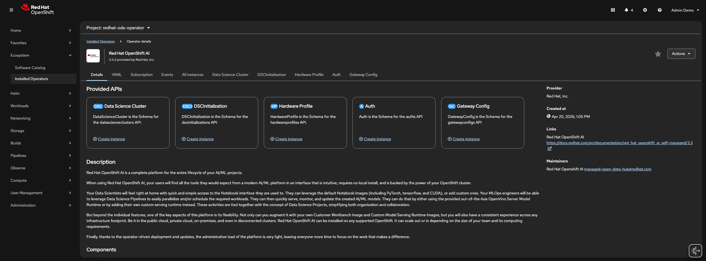
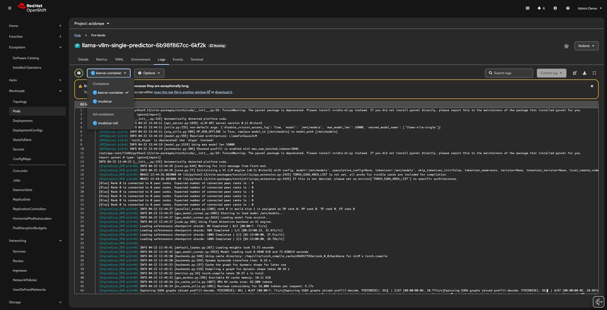

# Review OpenShift AI Components

This module reviews the end-to-end technical workflow for establishing a robust model-serving architecture within Red Hat OpenShift AI (RHOAI). It begins with the foundational infrastructure, detailing the necessary Operators (such as the GPU and Node Feature Discovery operators) and Data Science Project (DSP) configurations required to prep the environment for machine learning workloads.

## Red Hat OpenShift AI — Operators and requirements

Review the operator installation and OpenShift Data Science Project configuration following the next steps:

1. Open the [OpenShift console](https://console-openshift-console.<CLUSTER_DOMAIN>) and confirm that the OpenShift AI operator is installed: **Ecosystem** → **Installed Operators** → **Red Hat OpenShift AI**



2. In addition to the console, verify the operator by checking its pods in the target namespace:

```bash
oc get pods -n redhat-ods-operator
```

* **Sample `oc get pods` output** (replica names and ages will differ):

```text
NAME                              READY   STATUS    RESTARTS         AGE
rhods-operator-58775b456f-5s7b9   1/1     Running   0                44h
rhods-operator-58775b456f-l2fv9   1/1     Running   0                44h
rhods-operator-58775b456f-qknw7   1/1     Running   0                44h
```

## Red Hat OpenShift AI — DSP configuration

Review the OpenShift Data Science configuration for KServe using the following procedure.

1. Confirm that KServe is set to `Managed`:

```bash
oc get dsc -n redhat-ods-operator default-dsc -o jsonpath='{.spec.components.kserve.managementState}'
```

!> `managementState` must be **Managed** to enable KServe.

For field documentation for KServe under `dsc.spec.components`, run:

```bash
oc explain dsc.spec.components.kserve
```

2. When `managementState` is `Managed`, the KServe controller manager is active. Verify that the controller pods are running:

```bash
oc get pod -n redhat-ods-applications -l app.kubernetes.io/name=kserve-controller-manager
```

* **Sample `oc get pod` output:**

```text
NAME                                         READY   STATUS    RESTARTS   AGE
kserve-controller-manager-7d4cbdff89-cb9wz   1/1     Running   0          44h
```

?> This pod is the KServe **controller**: it reconciles `ServingRuntime` and `InferenceService` objects in the cluster. Later sections revisit it; for now, note that it is the control plane for inference CRs, not the model workload itself.

## Create a ServingRuntime and an InferenceService

The core of model serving **focuses** on the KServe stack—specifically the interaction between the **ServingRuntime** Custom Resource Definition (CRD), which defines the execution environment or *template* for models, and the **InferenceService** CRD, which is the main object for deploying a specific model and wiring it to that runtime.

By examining these components, the review explains how the Predictor, Transformer, and Explainer work in tandem to provide scalable, high-performance inference endpoints that abstract away the underlying complexity of the Kubernetes networking and storage layers.

1. Please create a `ServingRuntime` to make available a new runtime for deploying models and verify the respective configuration:

```bash
oc new-project <USER_NAME>
```

2. Create a `ServingRuntime` to expose a new runtime for model deployment:

```bash
cat << 'EOF' | oc apply -n <USER_NAME> -f-
apiVersion: serving.kserve.io/v1alpha1
kind: ServingRuntime
metadata:
  annotations:
    opendatahub.io/apiProtocol: REST
    opendatahub.io/recommended-accelerators: '["nvidia.com/gpu"]'
    opendatahub.io/runtime-version: v3.2.4
    opendatahub.io/serving-runtime-scope: global
    openshift.io/display-name: RHAIIS (vLLM) NVIDIA GPU ServingRuntime for KServe
    openshift.io/template-display-name: RHAIIS (vLLM) NVIDIA GPU ServingRuntime for KServe
    opendatahub.io/template-name: rhaiis-cuda-template
  labels:
    opendatahub.io/dashboard: "true"
  name: rhaiis-cuda
spec:
  annotations:
    prometheus.io/path: /metrics
    prometheus.io/port: "8000"
  containers:
  - args:
    - --port=8000
    - --model=/mnt/models
    - --served-model-name={{.Name}}
    - --max-model-len=16000
    - --disable-uvicorn-access-log
    command:
    - python
    - -m
    - vllm.entrypoints.openai.api_server
    env:
    - name: HF_HOME
      value: /tmp/hf_home
    - name: HF_HUB_OFFLINE
      value: "1"
    - name: VLLM_NO_USAGE_STATS
      value: "1"
    image: registry.redhat.io/rhaiis/vllm-cuda-rhel9:3.2.4
    name: kserve-container
    ports:
    - containerPort: 8000
      protocol: TCP
  multiModel: false
  supportedModelFormats:
  - autoSelect: true
    name: vLLM
EOF
```

3. Verify the runtime was created.

```bash
oc get ServingRuntime -n <USER_NAME>
```

* **Sample `oc get ServingRuntime` output** (column order may vary slightly by CLI version):

```text
NAMESPACE     NAME         DISABLED   MODELTYPE   CONTAINERS         AGE
<USER_NAME>      rhaiis-cuda             vLLM        kserve-container   118s
```

4. As mentioned, it is time to create the inference service that links a specific model with a runtime, defining the main configuration for the service. Please create the following example and verify the configuration:

[vLLM manifest](_createvllm.md ':include')

5. Review the kserve controller manager pod to understand what is happening under the hood:

```bash
oc logs -n redhat-ods-applications -l app.kubernetes.io/name=kserve-controller-manager -f --tail=50
```

**Sample log lines** (JSON structure; messages and fields vary by version):

```text
{"level":"info","ts":"2026-04-23T07:39:58Z","logger":"v1beta1Controllers.InferenceService","msg":"Inference service deployment mode ","deployment mode ":"RawDeployment"}
{"level":"info","ts":"2026-04-23T07:39:58Z","logger":"v1beta1Controllers.InferenceService","msg":"Reconciling inference service","apiVersion":"serving.kserve.io/v1beta1","isvc":"llama-vllm-single"}
{"level":"info","ts":"2026-04-23T07:39:58Z","logger":"CaBundleConfigMapReconciler","msg":"Reconciling CaBundleConfigMap","namespace":"<USER_NAME>"}
{"level":"info","ts":"2026-04-23T07:39:58Z","logger":"PredictorReconciler","msg":"Resolved container","container":"nil","podSpec":{"containers":[{"name":"kserve-container","image":"registry.redhat.io/rhaiis/vllm-cuda-rhel9:3.2.4","command":["python","-m","vllm.entrypoints.openai.api_server"],"args":["--port=8000","--model=/mnt/models","--served-model-name=llama-vllm-single","--max-model-len=16000","--disable-uvicorn-access-log"],"ports":[{"containerPort":8000,"protocol":"TCP"}],"env":[{"name":"HF_HOME","value":"/tmp/hf_home"},{"name":"HF_HUB_OFFLINE","value":"1"},{"name":"VLLM_NO_USAGE_STATS","value":"1"}],"resources":{"limits":{"cpu":"4","memory":"8Gi","nvidia.com/gpu":"1"},"requests":{"cpu":"4","memory":"8Gi","nvidia.com/gpu":"1"}}}],"automountServiceAccountToken":false}}
{"level":"info","ts":"2026-04-23T07:39:58Z","logger":"ServiceReconciler","msg":"service reconcile","checkResult":2,"err":null}
```

## Inference service components

When an `InferenceService` is created, it is possible to see specific components and signal that represent the new inference service creation. Please follow next steps to understand the staff behind the scenes.

1. Review inference services pods:

```bash
oc get pods -n <USER_NAME>
```

* A block similar to the following is expected to appear...

```text
NAME                                           READY   STATUS    RESTARTS   AGE
llama-vllm-single-predictor-6b98f867cc-6kf2k   2/2     Running   0          5m
```

2. Open the [OpenShift console](https://console-openshift-console.<CLUSTER_DOMAIN>) and see also the containers inside the pod: **Worloads** → **Pods** → **Logs (tab)**



Review the roles of each container in this OCI modelcar–style setup:

?> `modelcar-init` -> The primary goal of the modelcar-init container is to pre-fetch and extract model files from an Open Container Initiative (OCI) registry before the model serving pod fully starts (Note that the modelcar-init container is only present for deployments using OCI registries; it is not used if your model is stored in an S3-compatible object storage or a Persistent Volume Claim (PVC), as those methods allow the main container to access the model files directly)

?> `kserver-container` -> The primary goal of the kserve-container is to act as the main container within a KServe inference service pod. Its core responsibilities are to load the AI model into memory and run the actual inference server runtime, such as vLLM, OpenVINO, or custom runtimes.

?> `modelcar` -> The primary goal of the modelcar container is to act as a sidecar that provides the main inference server (the kserve-container) with continuous access to the model files extracted from an Open Container Initiative (OCI) image throughout the entire lifetime of the pod (The modelcar sidecar is exclusively used when you deploy models stored as OCI container images. If you deploy a model from S3-compatible object storage or a Persistent Volume Claim (PVC), this container is not present).

3. Finally, test the new inference service:

* Port forward to the pod

```bash
oc port-forward -n <USER_NAME> deployment/llama-vllm-single-predictor 8000:8000
```

* **List models** (OpenAI-compatible `v1/models`):

```bash
curl http://localhost:8000/v1/models | jq .
```

*Example JSON response* (`created` and permission IDs are runtime-generated):

```json
{
  "object": "list",
  "data": [
    {
      "id": "llama-vllm-single",
      "object": "model",
      "created": 1776872323,
      "owned_by": "vllm",
      "root": "/mnt/models",
      "parent": null,
      "max_model_len": 16000,
      "permission": [
        {
          "id": "modelperm-ea7f91dd59f0432fa3317729142015b7",
          "object": "model_permission",
          "created": 1776872323,
          "allow_create_engine": false,
          "allow_sampling": true,
          "allow_logprobs": true,
          "allow_search_indices": false,
          "allow_view": true,
          "allow_fine_tuning": false,
          "organization": "*",
          "group": null,
          "is_blocking": false
        }
      ]
    }
  ]
}
```

* Finally, test inference:

```bash
curl http://localhost:8000/v1/completions \
  -H "Content-Type: application/json" \
  -d '{
    "model": "llama-vllm-single",
    "prompt": "San Francisco is a",
    "max_tokens": 50,
    "temperature": 0.7
  }' | jq .
```

Example output:

```bash
...
  "model": "llama-vllm-single",
  "choices": [
    {
      "index": 0,
      "text": " top tourist destination in the United States, attracting millions of visitors each year. From its iconic Golden Gate Bridge to its vibrant neighborhoods like Haight-Ashbury and Fisherman's Wharf, there's no shortage of things to see and do in this",
...
```

[vLLM manifest delete](_deletevllm.md ':include')