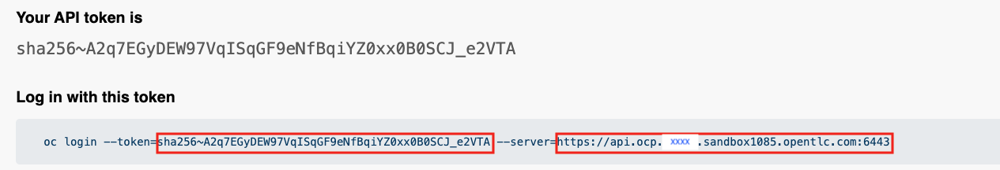
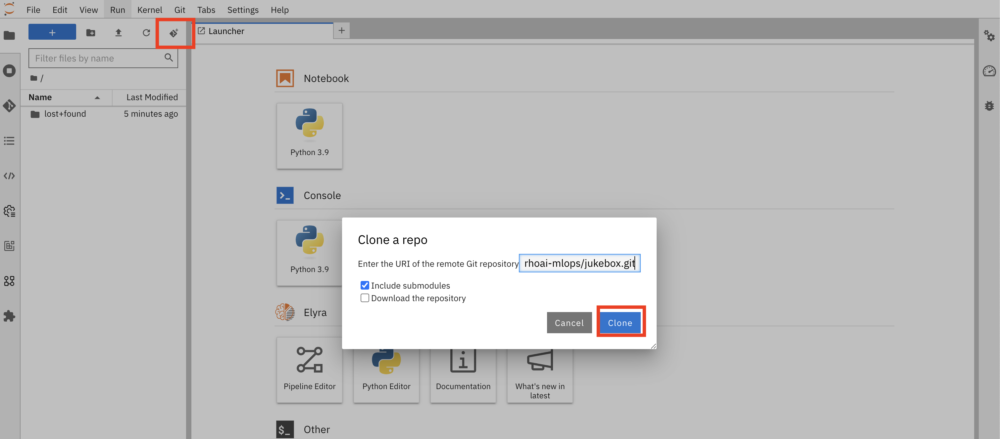
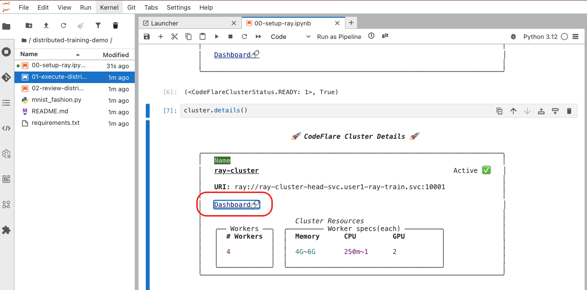
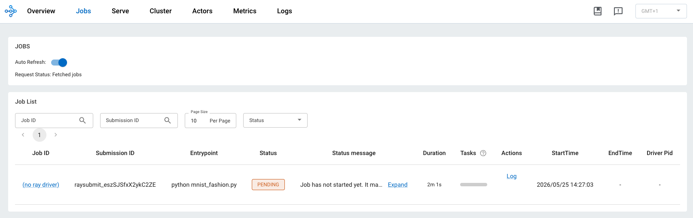
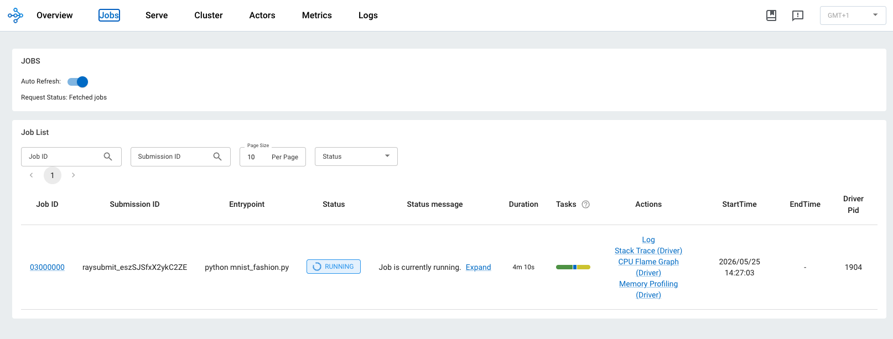
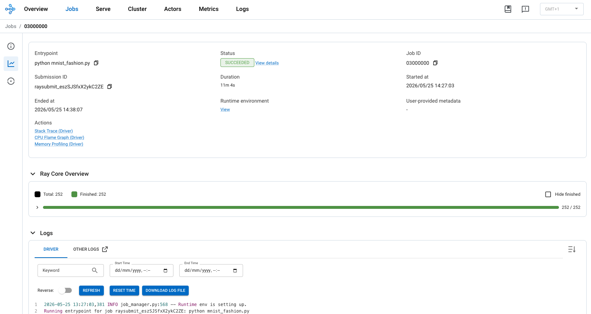

# 🚀 Distributed data-parallel training with PyTorch (Kueue, Ray & CodeFlare)

This lab shows how to run distributed data-parallel training with PyTorch on an Anyscale cluster using Ray Train. You train a ResNet-18 model on MNIST across multiple GPUs, with built-in support for checkpointing, metrics reporting, and distributed orchestration. The idea is to execute this distributed training using both workbenches and pipelines. 

The goal is to run this training flow from both **workbenches** 🖥️ and **pipelines** 🔁 — let's get the foundation in place first!

## 🏗️ Prepare your project namespace

Before working with pipelines or workbenches, create the Data Science project and wire it into Kueue.

### 1️⃣ Create the Data Science project

```bash
cat << 'EOF' | oc apply -f-
apiVersion: v1
kind: Namespace
metadata:
  name: <USER_NAME>-ray-train
  labels:
    name: <USER_NAME>-ray-train
    opendatahub.io/dashboard: 'true'
    kueue.openshift.io/managed: 'true'
EOF
```

?> 📂 This namespace is your **home base** for Ray clusters, workbenches, and training jobs in this lab.

### 2️⃣ Create a LocalQueue for Ray workloads

Kueue uses **LocalQueues** to admit workloads from a namespace into a shared **ClusterQueue**. This one routes Ray training requests to the default cluster queue.

```bash
cat << 'EOF' | oc apply -n <USER_NAME>-ray-train -f -
apiVersion: kueue.x-k8s.io/v1beta2
kind: LocalQueue
metadata:
  namespace: <USER_NAME>-ray-train
  name: ray-train-lq
spec:
  clusterQueue: default
EOF
```

?> It is possible to review the logs in the kueue-controller-manager pods in the namespace openshift-kueue-operator

```bash
oc logs -n openshift-kueue-operator -l control-plane=controller-manager
```

* Similar logs expected

```text
...
{"level":"Level(-2)","ts":"2026-05-26T13:25:46.795904084Z","logger":"localqueue-reconciler","caller":"core/localqueue_controller.go:215","msg":"LocalQueue create event","replica-role":"leader","localQueue":{"name":"ray-train-lq","namespace":"user1-ray-train"}}
{"level":"Level(-2)","ts":"2026-05-26T13:25:46.796045481Z","logger":"localqueue-reconciler","caller":"core/localqueue_controller.go:167","msg":"Reconcile LocalQueue","replica-role":"leader","namespace":"user1-ray-train","name":"ray-train-lq","reconcileID":"sdaw35123-179c-4e42-bf92-41e41fd12cd1"}
{"level":"Level(-2)","ts":"2026-05-26T13:25:46.801669833Z","logger":"localqueue-reconciler","caller":"core/localqueue_controller.go:254","msg":"Queue update event","replica-role":"leader","localQueue":{"name":"ray-train-lq","namespace":"user1-ray-train"}}
{"level":"Level(-2)","ts":"2026-05-26T13:25:46.801740167Z","logger":"localqueue-reconciler","caller":"core/localqueue_controller.go:167","msg":"Reconcile LocalQueue","replica-role":"leader","namespace":"user1-ray-train","name":"ray-train-lq","reconcileID":"xxq34sad2-001d-41cd-90f2-7f8d83c3555b"}
```

?> 🎫 Think of the LocalQueue as a **ticket window**: your Ray jobs line up here before Kueue decides when they can run.

### 3️⃣ Create a HardwareProfile for running Ray workloads

As you already know, Kueue uses **LocalQueues** to admit workloads from a namespace into a shared **ClusterQueue**. It is also required to create a HardwareProfile for running workloads using GPUs and the respective Queues.


```bash
cat << 'EOF' | oc apply -f-
apiVersion: infrastructure.opendatahub.io/v1
kind: HardwareProfile
metadata:
  annotations:
    opendatahub.io/dashboard-feature-visibility: '["workbench","model-serving"]'
    opendatahub.io/hardware-profile-namespace: 'user1-ray-train'
    opendatahub.io/managed: 'false'
  name: user1-ray-train-profile
  namespace: user1-ray-train
  labels:
    app.kubernetes.io/part-of: hardwareprofile
    app.opendatahub.io/hardwareprofile: 'true'
    kueue.openshift.io/managed: 'true'
spec:
  identifiers:
    - defaultCount: 2
      displayName: CPU
      identifier: cpu
      maxCount: 4
      minCount: 1
      resourceType: CPU
    - defaultCount: 4Gi
      displayName: Memory
      identifier: memory
      maxCount: 8Gi
      minCount: 2Gi
      resourceType: Memory
    - defaultCount: 2
      displayName: GPU
      identifier: nvidia.com/gpu
      maxCount: 4
      minCount: 2
      resourceType: Accelerator
  scheduling:
    kueue:
      localQueueName: ray-train-lq
      priorityClass: None
    type: Queue
EOF
```

---

## 🖥️ Workbench path

The workbench path is the fastest way to experiment interactively. You will spin up a GPU notebook, deploy a Ray cluster with CodeFlare, and launch your first distributed training job from Jupyter.

### Create the workbench

You can reuse an existing workbench in a project that already runs a **Standard Data Science** (or similar) image with the CodeFlare SDK — or create a fresh one:

1. 🔐 Log in to **OpenShift AI** *(link and credentials are provided by your instructor)*.

2. 📁 Click the **`<USER_NAME>-ray-train`** project — this is where we experiment and train.

3. 📓 Create a notebook: **Workbenches** → **Create Workbench**. The dashboard is pretty intuitive, isn't it? 😄

   | Setting | Value |
   | --- | --- |
   | **Name** | `<USER_NAME>-ray-train-wb` |
   | **Notebook image** | Jupyter \| PyTorch \| CUDA \| Python 3.12 |
   | **Version** | 2025.2 |
   | **Hardware profile** | `gpu-profile` |
   | **GPU requests** | 2 *(expand Customize resource requests and limits)* |
   | **GPU limits** | 4 |

4. ▶️ When the workbench status shows **Running**, click its name to open the JupyterLab environment.

?> 🎯 **Why 2–4 GPUs on the workbench?** The notebook needs enough local GPU headroom to orchestrate Ray while workers run on the cluster. Your instructor may suggest different values for your environment.

---

### Set up Ray and run training

Now we'll use the workbench to deploy a Ray cluster and kick off distributed training.

!> 🔑 **Do this first:** grab your **OpenShift API token** and **API server URL** before going further.

Open the OpenShift console → click your username (top right) → **Copy login command** → run it in a terminal and save the token and server URL. You will need them in the setup notebook.



1. Clone the demo repository [distributed-training-demo](https://github.com/rh-ai-infra-ws/distributed-training-demo) into your workbench workspace 📥.



After cloning the repository, you should see the `distributed-training-demo` folder in the left-hand panel.

2. Deploy the Ray cluster ⚡ Open and follow **`00-setup-ray.ipynb`** in Jupyter. This notebook uses the CodeFlare SDK to create a Ray cluster in your namespace.

!> Access to the Ray Cluster Dashboards (*SPOILER* You'll need it in next steps)



3. Verify Ray pods are healthy 🩺

```bash
oc get po -n <USER_NAME>-ray-train
```

?> ✅ **`READY=True`** means the head and worker pods are up and ready to accept training tasks.

```text
NAME                                               READY   STATUS    RESTARTS   AGE
...
ray-cluster-head-kxpj8                             2/2     Running   0          110s
ray-cluster-small-group-ray-cluster-worker-9f6m7   1/1     Running   0          110s
ray-cluster-small-group-ray-cluster-worker-rx7t5   1/1     Running   0          110s
ray-cluster-small-group-ray-cluster-worker-sllcd   1/1     Running   0          110s
ray-cluster-small-group-ray-cluster-worker-vqsml   1/1     Running   0          110s
...
```

?>You should see one **head** pod and several **worker** pods — that's your mini GPU fleet! 🚢

4. Launch distributed training 🏋️ Open and follow **`01-execute-distributed-trainig.ipynb`**. Ray Train will shard MNIST batches across workers and synchronize gradients for data-parallel learning.

5. Watch the job in the Ray dashboard 📊  Connect to the Ray cluster dashboard for a live view of job execution.

**Pending** — the job is queued and waiting for resources:



After a few seconds, the job should **start running**:



After a few minutes, the job should **complete** — review logs and metrics in the UI:



?> 📈 Keep an eye on **GPU utilization** and **task timeline** in the dashboard — great way to see data parallelism in action!

6. Review logs with CodeFlare 📋 For programmatic access to job history and logs, follow **`02-review-distributed-trainig.ipynb`**, which uses the CodeFlare SDK to inspect completed runs.